# Project 4 - Better | Health | Care - A Online Booking System for Patients.

## Introduction
```diff 
Better | Health | Care - A  Django Framework Project with the implementation of CRUD (Create, Read, Update, Delete)
```

This project is a Full Stack website built using the Django framework. Better Health Care is a healthcare provision to provide patients the ability to book appointments with doctors. The users once registered can book, view and manage their appointments. If the admin declines the booking then users have the ability to rebook on another date.

Some the key functions of the services are as below:
+ Booking Appointments Online
+ Manage Appointments Options
+ Edit Appointments 
+ Delete Appointments
+ Login and Logout Facilities 
+ Register as new user
+ About Us page
+ Contact us form


[View link to my project 4](https://better-health-care.herokuapp.com/)


## User Experience - UX
+ As a site user, I can:
1. Navigate around the site and be able to use the desired functions. 
2. Register as a new user to be able to book appointments.
3. Login as an exisiting user to be able to book appointments.
4. View booked appointments and view the status of the appointments.
5. Manage bookings, update, edit dates or cancel the bookings.
6. Contact the health care with feedback and concerns. 
7. View the About us page, to decide whether to use the services.
8. Logout once the service is not required. 

+ As a site admin, I can:
1. View new registered users.
2. View booked appointments.
3. View feedback and concerns.
3. Create a new user and bookings.
4. Delete a user and bookings.
5. Decline bookings 
6. View outstanding appointments waiting for admin approval requests.
7. View how many appointments on each date and with which doctor. 

## Agile Methodology
An Agile Approach was used to develop this site. This was achieved by breaking the project down into smaller tasks.
To complete the overall aim of the website, 15 issues were created as specific tasks called User Stories. These User Stories are small sections of the project designed to accomplish a specific goal. Once the User Story was working effectively it was moved across the Kanban board, in the following working order. 
+ To do
+ In Progress
+ Done

 My Projects and User Stories can be viewed here :  [Issues and Projects](https://github.com/Shanbashir1/Better-Health-Care/issues "Github Issues")

 ## Project Design
 ### Wireframes
Balsamiq wireframes was used to design the wireframes used in the design phase of this project.

[Balsamiq Wireframes](https://balsamiq.cloud/spvy67g/pamoowu/r671F?f=N4IgUiBcCMA0IDkpxAYWfAMhkAhHAsjgFo4DSUA2gLoC%2BQA%3D "Balsamiq Wireframes")

### Database Diagram
Lucid Charts was used to design the unique models used in this project.

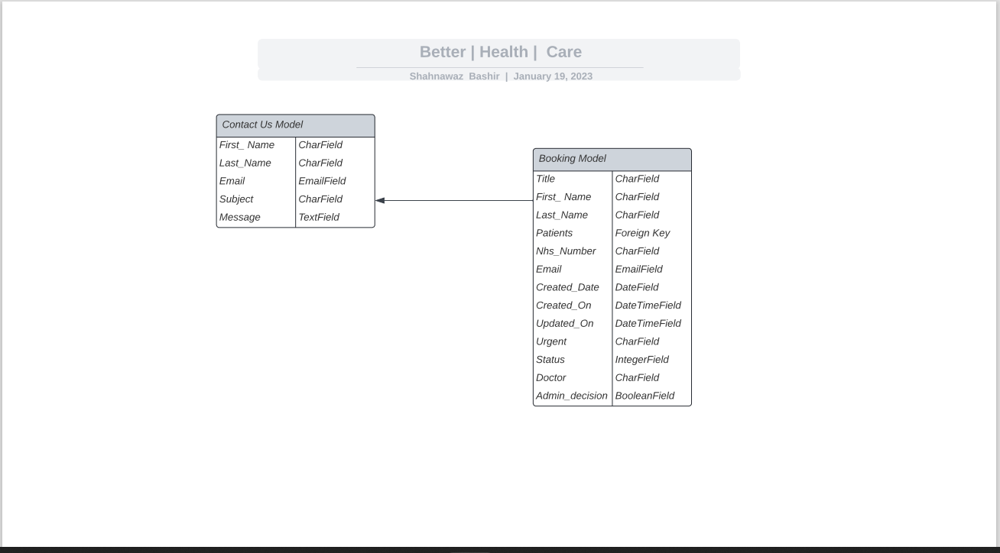

### Colour Contrast
The selection of the colours for the web page was chosen from Color Hex. The colour contrast tried to remain basic and have a good flow of similiar colours throughout the design. 

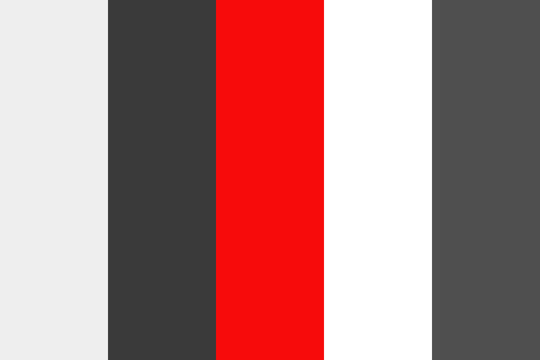

## Site Features 

### Favicon Icon 
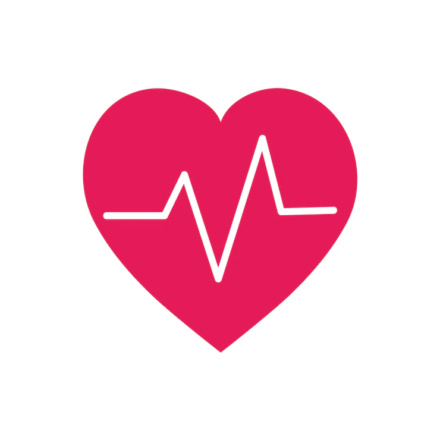

+ The selected icon was a image of a heart pulse , as you would see relating to the healthcare provision. 
+ The image is displayed on all the pages, throughout the website to give a unique design for the users
+ The favicon image is a design which contributes to the overall web design

### Header
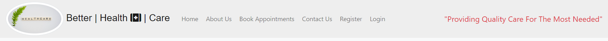

+ The header is located at the top of the page, displaying the logo, The clinics name and the Navigation links. 
+ The color used for the header was #eeeee, which was the main color used throughout the site. 
+ The color font was majoritly black, but contained some text in the header in the color red.  
+ The header contained a bolder font function when hovering over the navigation bar.

### Footer
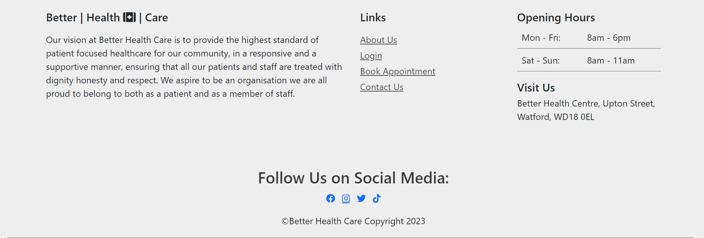

+ The footer contains quite a few links and information for the users
+ Information text to support the user and give a insight on the what the clinic has to offer.
+ Links to navigate around the site are also available to the user. 
+ Opening Hours and closing hours are shown on the footer for users to have clear indication of the clinics timings. 
+ Social media links with clear icons are on the footer for user to navigate and connect the clinics social pages. 
+ A clear header showing "Visit us" is also on the footer, with the address, to make aware to the user the location of the clinic. 

### Site Navigation
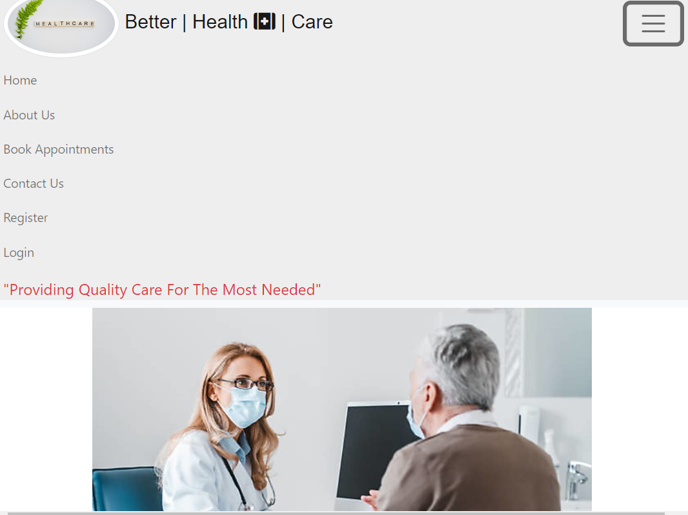

+ Site Navigation is available on both the header and the footer. 
+ On mobile devices the menu icon drops down, and on the full screen desktop devices the navigation bar remains fixed. 
+ The navigation links contain the following features : 
1. Home Page
2. About us Page
3. Book Appointments
4. Conatct Us 
5. Register 
6. Login - Disapears onces Logged in
7. Logout - Appears Once Logged in 
8. Manage Appointments - Appears Once Logged in

### Home Page
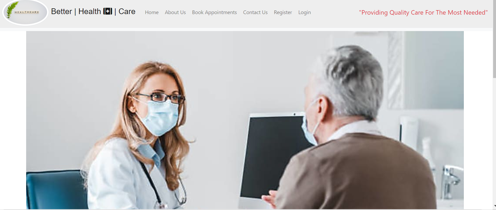

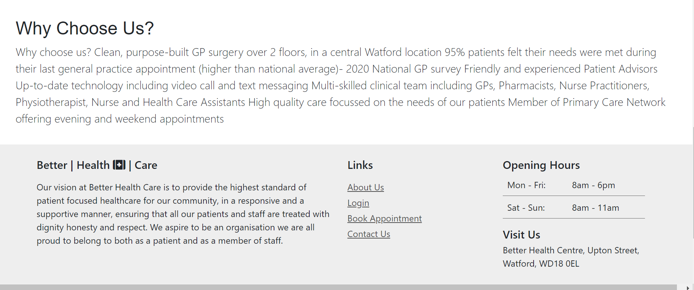

+ The homepage includes a image of a patient and a doctor having a consultation. The image was improted from pexels.com
+ The homepage has some text to reflect to the user as why they should choose the clinic. The text is a small paragraphy showing the user data and feature of clinic. 
+ The hompage is a simple page with a good color contrast, it is simple and easy to navigate to other pages.
+ The background color is a white background and the remaining color contrast is of those from the header and footer. 
+ Bootstrap 4 was used to design the Home page with some minor adjustments using internal CSS. 

### About Us Page
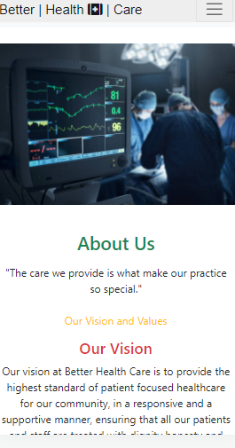
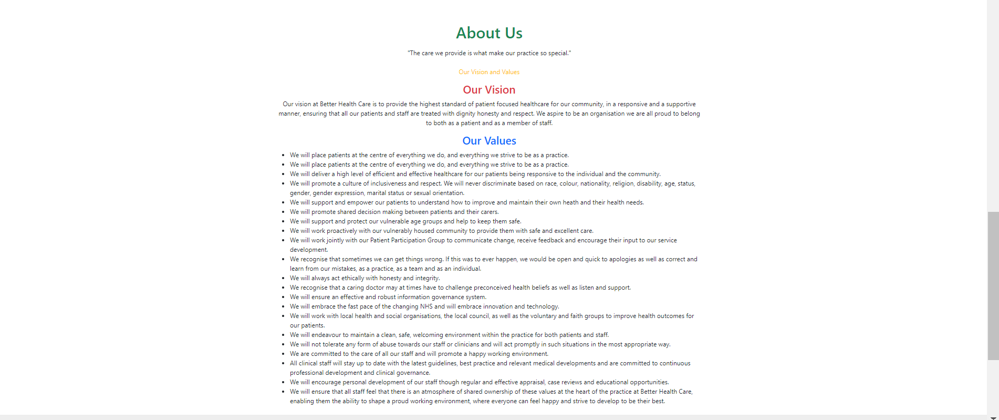


+ The about page was designed to give the user a background and detail of the clinics services and values. 
+ The about page was designed using Bootstrap 4 and the color font was also used using Boostrap 4. 
+ The image was a image of a patient under medical care and was imported from pexels.com. 
+ The text was designed using bullets points and gave the user a clear indication of the clinics values and care requirements. 

### Booking Appointment Page (Create Booking)
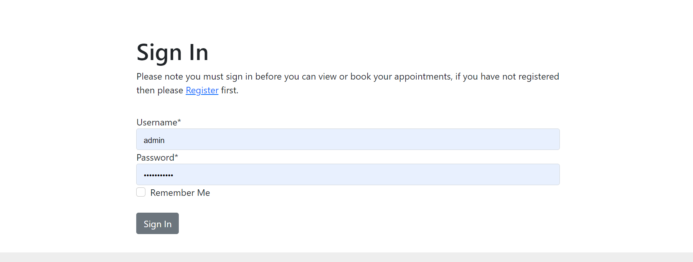
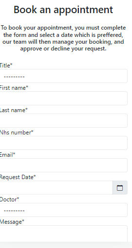

+ The Booking Appointmment page does not allow a user to book any appointment untill he has signed in. So a user would need to register or sign in before accessing the booking appointment form
+ Once the user has signed they are navigated to the booking form, were they can make a booking. 
+ The booking is a feature which has been imported from crispy forms, and it also has datepicker facility to select dates using a calender.
+ The booking form has the following fields : <span style="color:red">**All fields are compulsary to fill in.**</span>
1. Title (Drop down Title option)
2. First Name 
3. Last Name 
4. Nhs Number 
5. Email
6. Request Date (Drop down Calender)
7. Doctor (Drop down Doctor option)
8. Message 
9. Urgent (Drop down urgent option)
+ The Booking form if completed correctly will forward the user to the manage booking page. Otherwise it will request the user to correctly complete all the fields.
+ The user is also send a message once the booking has been made 
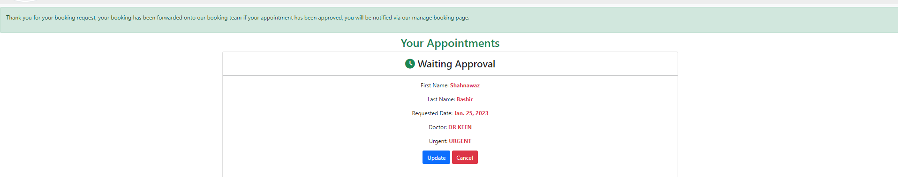

### Manage Booking Page (Read/View Booking)
<span style="color:blue">**If a appointment has been approved by the admin**</span>
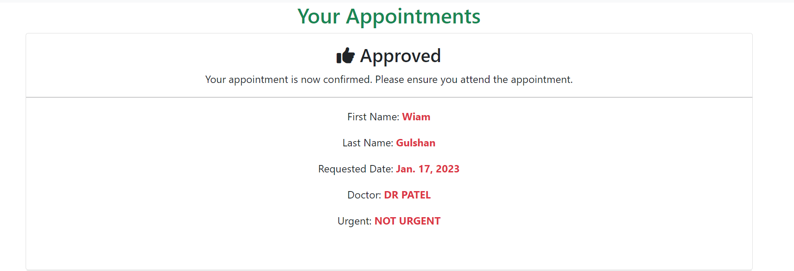

+ So once a user has made a succesful booking, the booking is forwarded onto our manage booking page. Once the booking has been approved, the Approved notification will be displayed to the users, depending if the user is logged in. 
+ A font Awesome thumbs up icon was used to design the Approved notification.
+ <span style="color:red">*Your appointment is now confirmed. Please ensure you attend the appointment*</span> This text informs the user that the appointment has been approved and booked in and that they should attend the clinic. 
+ The booking has information on the user,  such as 
1. First Name 
2. Last Name 
3. Requested Date 
4. Doctor 
5. Urgent / Not Urgent 

<span style="color:blue">**If a appointment has been declined by the admin**</span>
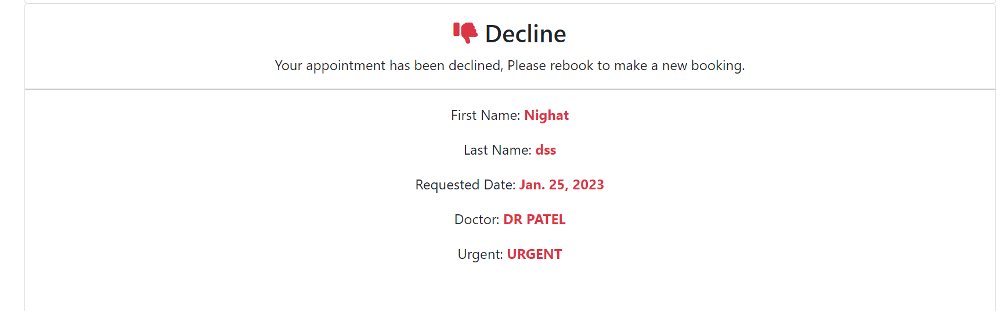

+ So once a user has made a succesful booking, the booking is forwarded onto our manage booking page. If the  booking has been declined, the decline notification will be displayed to the users, depending if the user is logged in. 
+ A font Awesome thumbs down icon was used to design the Approved notification.
+ <span style="color:red">*Your appointment has been declined. Please rebook to make a new booking*</span> This text informs the user that the appointment has been declined and that they should rebook.
+ The booking has information on the user,  such as 
1. First Name 
2. Last Name 
3. Requested Date 
4. Doctor 
5. Urgent / Not Urgent 

<span style="color:blue">**If a appointment has been booked and awaiting approval by the admin**</span>
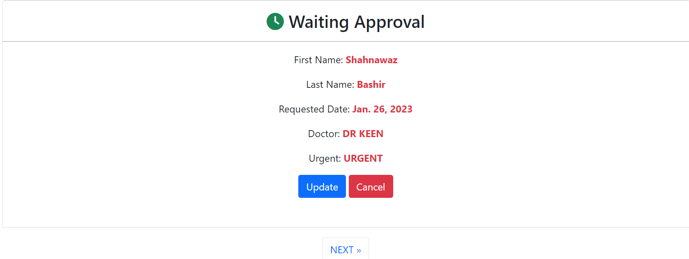

+ So once a user has made a succesful booking, the booking is forwarded onto our manage booking page. If the booking has not been viewed by the admin, the booking will remain in it orginal waiting approval stage, this depending if the user is logged in. 
+ A font Awesome clock icon was used to design the waiting-approval notification.
+ The booking has information on the user,  such as 
1. First Name 
2. Last Name 
3. Requested Date 
4. Doctor 
5. Urgent / Not Urgent 
+ While the booking is in waiting approval stage the user has got the chance to update the booking or cancel the booking. 
+ The user is also offered a pagination of 3 booking history per page. Which they can access by pressing the next or previous button. 

### Update Booking Page (Update Booking)
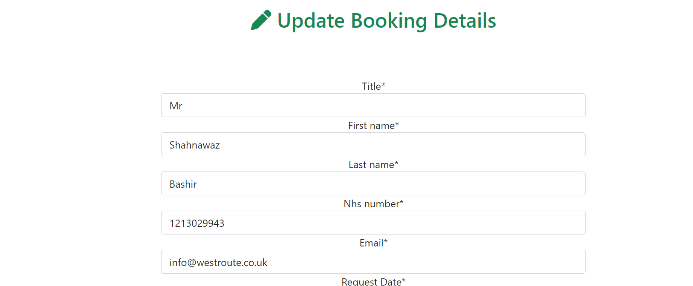

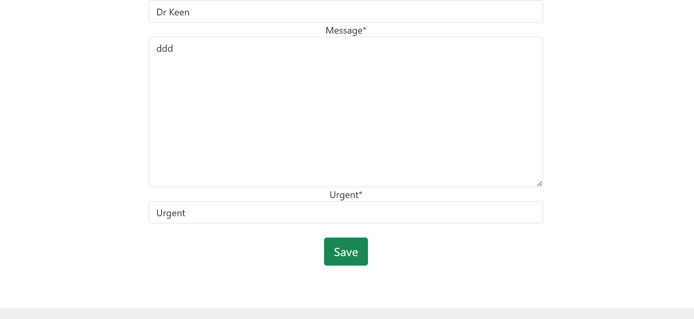

+ The Update Booking page will bring up your booking, which was orginally submitted by the user on the booking appointment page. The information they entered will have been saved and ready for updating only. 
+ Once the changes have been updated and saved, the bookign will back to the manage appointment page awaiting approval from the admin. 

### Delete Booking Page (Delete Booking)
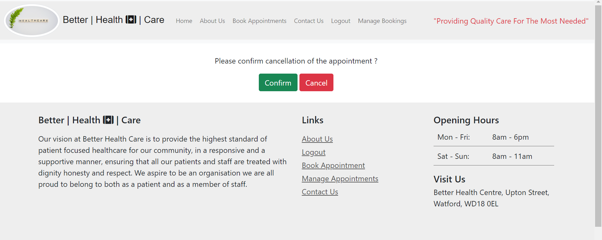

+ The delete booking page will have two buttons, and request the user as to whether they would confirm cancelling the booking, confirm cancellation will be a green button and cancel cancellation request will be a red button. 
+ The booking once cancelled will be removed from the users manage appointments database and also from the admin database. 

<span style="color:blue">**If a appointment has been deleted then no bookings will show in the manage appointment page**</span>
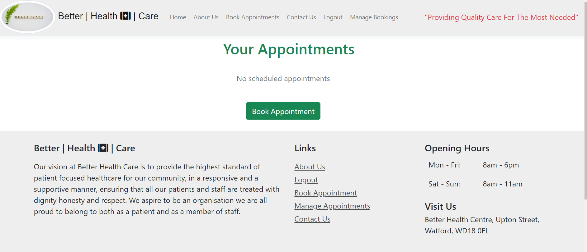

### Contact Us Page
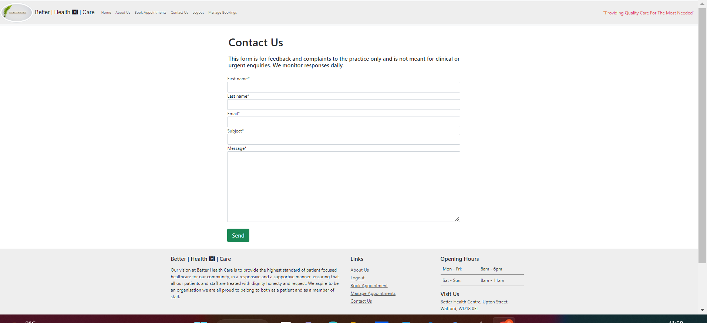

+ The contact us page, was created for feedback and complaints users may have about the clinic. 
+ The form allows the user to engage with the clinic so feedback can be forwarded on to relevant parties. 
+ The form is a simple created form which allows the user to enter his/her details and submit to the admin page. 
+ The form is then viewed by the admin and acted on accordingly. 
+ The form contains the following compulsary fields. 
1. First Name 
2. Last Name 
3. Email
4. Subject
5. Message 

+ Once the form has been completed it can be sent to the admin. 
+ The user is displayed with a success alert message, which dissapear after a few seconds. 
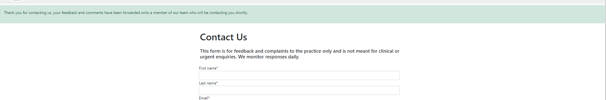

### Sign In / Login
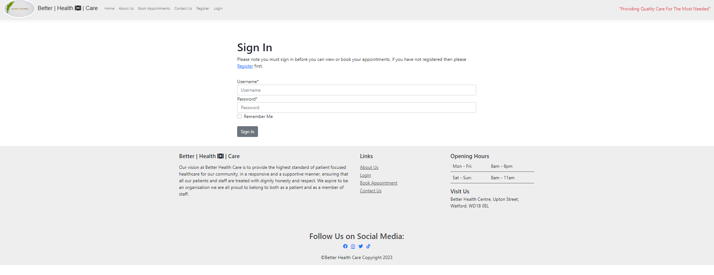

+ All existing users will need to sign into the site before they are allowed to book any appointments. 
+ Existing users may click the remember me tab, so they do not have to keep entering their details to view or make bookings. 
+ The sign in page allows users to signin or register if they are a new user.

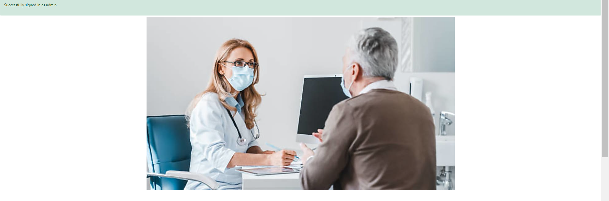

+ The user is greated with succesfully signed in 

### Register
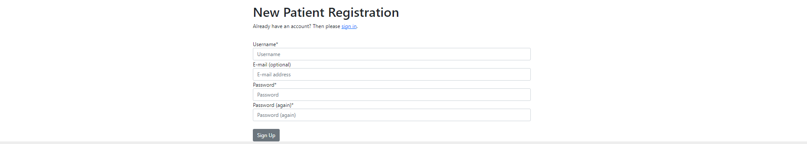

+ The register page allows users to register if they are a new user. 
+ The fields that are compulsary to complete are : 
1. Username
2. Password
3. Password(again)
4. Email (optional)
+ Once completed the user may sign in and create bookings. 

### Logout

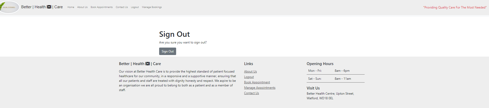

+ The user is displayed a message confirming they would like to sign out. 
+ If signed out is confirmed the user is signed out and restricted from viewing or creating any bookings.


