# Project 4 - Better | Health | Care - A Online Booking System for Patients.


## Table of content
+ [Introduction](#introduction)
+ [User Experience](#user-experience---ux)
+ [Agile Methodology](#agile-methodology)
+ [Wireframes](#wireframes)
+ [Database Diagram](#database-diagram)
+ [Color Contrast](#colour-contrast)
+ [Site Features](#site-features)
    + [Favicon Icon](#favicon-icon)
    + [Header](#header)
    + [Footer](#footer)
    + [Site Navigation](#site-navigation)
    + [Home Page](#home-page)
    + [About Us Page](#about-us-page)
    + [Booking Appointment Page](#booking-appointment-page-create-booking)
    + [Manage Booking Page](#manage-booking-page-readview-booking)
    + [Update Booking Page](#update-booking-page-update-booking)
    + [Delete Booking Page](#delete-booking-page-delete-booking)
    + [Contact us Page](#contact-us-page)
    + [Sign In](#sign-in--login)
    + [Register](#register)
    + [Sign Out](#logout)
    + [Admin](#admin-model)

+ [Future Features](#future-features)
+ [Testing](#testing)
+ [Technologies](#technologies)
+ [Libraries](#libraries)
+ [Security Features](#security-features-and-defensive-design)
+ [Form Features](#form-feature--validation)
+ [Database Security](#database-security)
+ [Deployment](#deployment)
    + [Local Deployment](#local-deployment)
    + [Heroku Deployment](#heroku-deployment-initial-stage-as-advised-by-code-institute)
    + [Elephant Postgressql](#postgresql-database-elephantsql)
    + [Github](#github)

+ [Credits](#credits)
+ [Acknowledgement](#acknowledgement)


## Introduction
```diff 
Better | Health | Care - A  Django Framework Project with the implementation of CRUD (Create, Read, Update, Delete)
```

This project is a Full Stack website built using the Django framework. Better Health Care is a healthcare provision to provide patients the ability to book appointments with doctors. The users once registered can book, view and manage their appointments. If the admin declines the booking then users have the ability to rebook on another date.

Some the key functions of the services are as below:
+ Booking Appointments Online
+ Manage Appointments Options
+ Edit Appointments 
+ Delete Appointments
+ Login and Logout Facilities 
+ Register as new user
+ About Us page
+ Contact us form

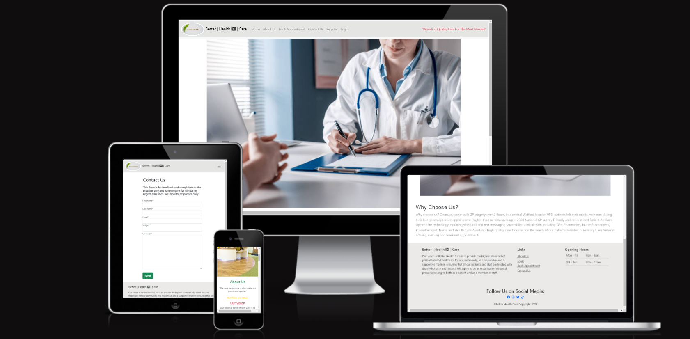

[View link to my project 4](https://better-health-care.herokuapp.com/)


## User Experience - UX
+ As a site user, I can:
1. Navigate around the site and be able to use the desired functions. 
2. Register as a new user to be able to book appointments.
3. Login as an exisiting user to be able to book appointments.
4. View booked appointments and view the status of the appointments.
5. Manage bookings, update, edit dates or cancel the bookings.
6. Contact the health care with feedback and concerns. 
7. View the About us page, to decide whether to use the services.
8. Logout once the service is not required. 

+ As a site admin, I can:
1. View new registered users.
2. View booked appointments.
3. View feedback and concerns.
3. Create a new user and bookings.
4. Delete a user and bookings.
5. Decline bookings 
6. View outstanding appointments waiting for admin approval requests.
7. View how many appointments on each date and with which doctor. 

## Agile Methodology
An Agile Approach was used to develop this site. This was achieved by breaking the project down into smaller tasks.
To complete the overall aim of the website, 15 issues were created as specific tasks called User Stories. These User Stories are small sections of the project designed to accomplish a specific goal. Once the User Story was working effectively it was moved across the Kanban board, in the following working order. 
+ To do
+ In Progress
+ Done

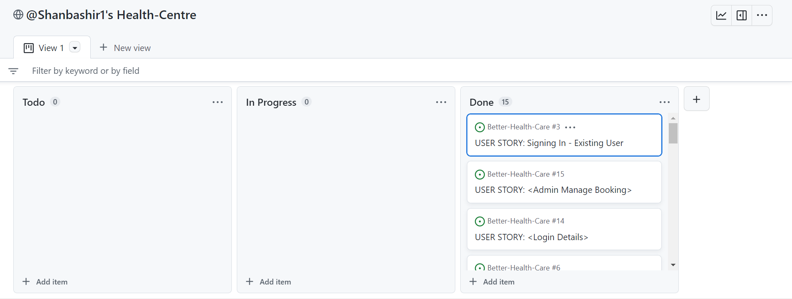

All my user stories were completed and succesfully actioned. The design was based on the Agile Methodology.


 My Projects and User Stories can be viewed here :  [Issues and Projects](https://github.com/Shanbashir1/Better-Health-Care/issues "Github Issues")


## Wireframes
Balsamiq wireframes was used to design the wireframes in the design phase of this project.

+ Home Page design

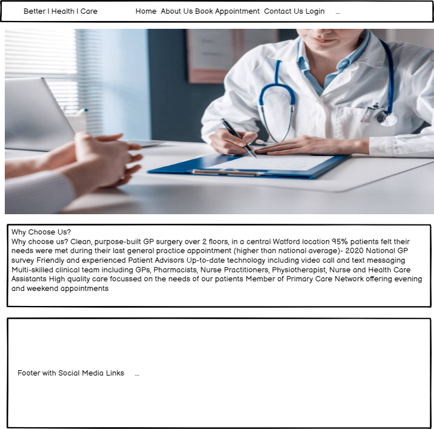

+ About Us Page design

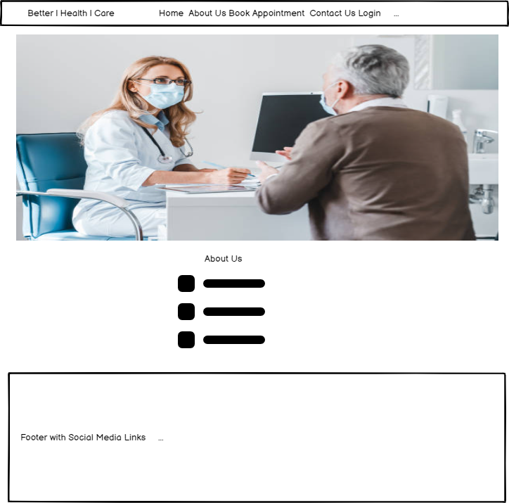

+ Booking Appointment design

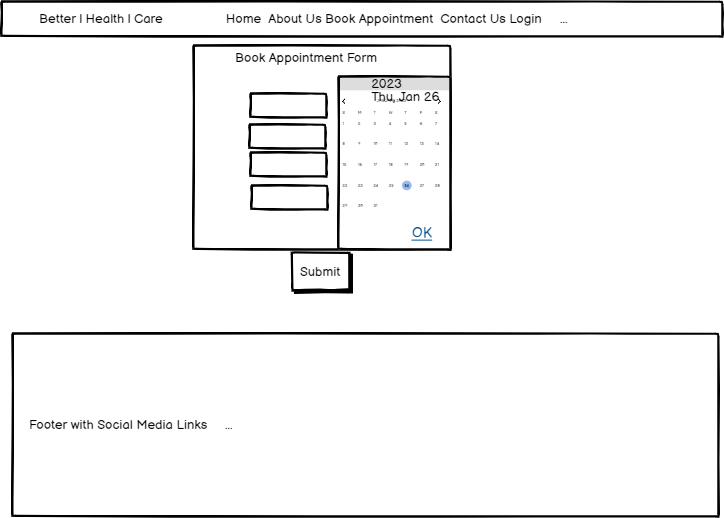

+ Manage Booking Page design

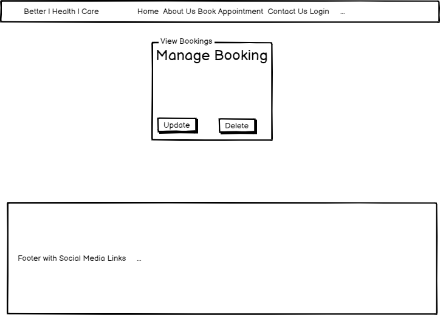

+ Login Page design

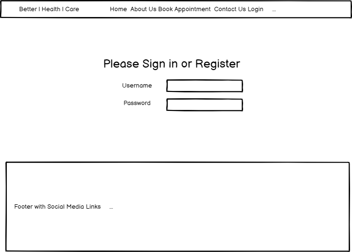


[Balsamiq Wireframes](https://balsamiq.cloud/spvy67g/pamoowu/r671F?f=N4IgUiBcCMA0IDkpxAYWfAMhkAhHAsjgFo4DSUA2gLoC%2BQA%3D "Balsamiq Wireframes")

## Database Diagram
Lucid Charts was used to design the unique models used in this project.

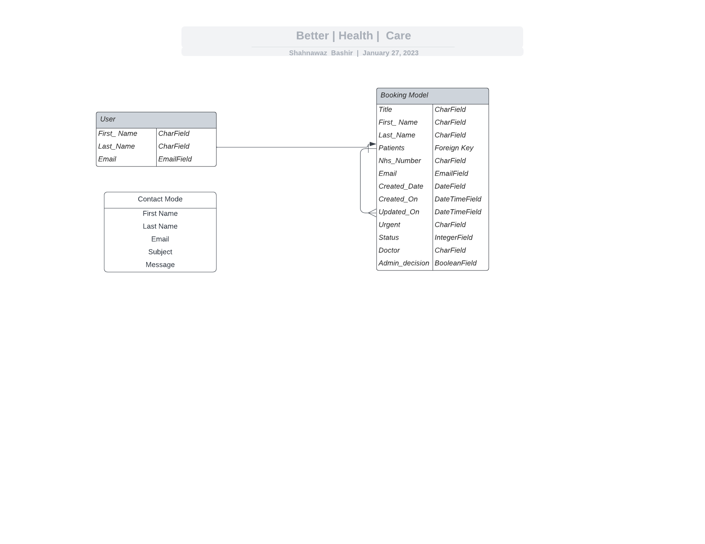

## Colour Contrast
The selection of the colours for the web page was chosen from Color Hex. The colour contrast tried to remain basic and have a good flow of similiar colours throughout the design. 

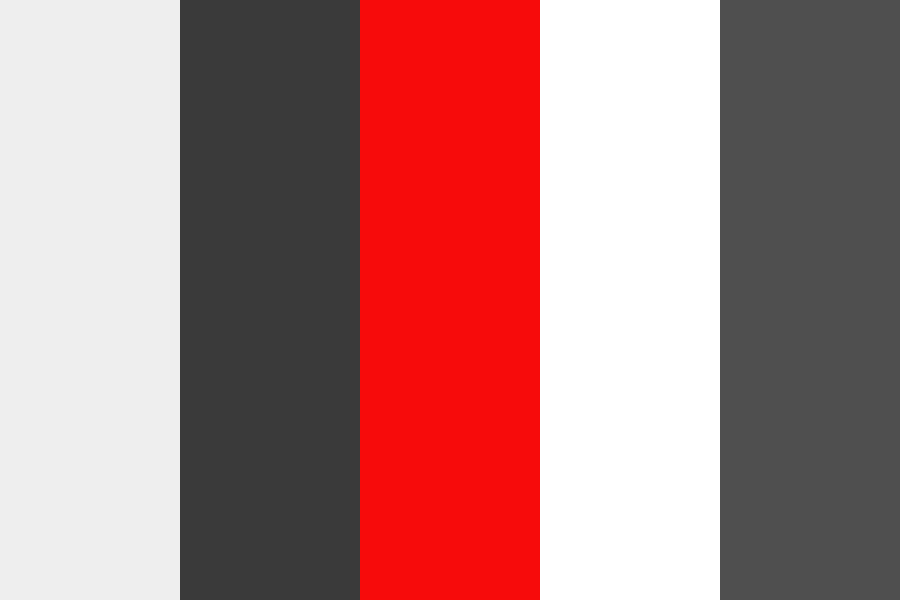

## Site Features 

### Favicon Icon 


+ The selected icon was a image of a heart pulse , as you would see relating to the healthcare provision. 
+ The image is displayed on all the pages, throughout the website to give a unique design for the users
+ The favicon image is a design which contributes to the overall web design

### Header
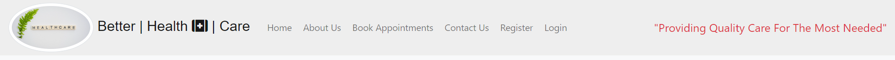

+ The header is located at the top of the page, displaying the logo, The clinics name and the Navigation links. 
+ The color used for the header was #eeeee, which was the main color used throughout the site. 
+ The color font was majoritly black, but contained some text in the header in the color red.  
+ The header contained a bolder font function when hovering over the navigation bar.

### Footer
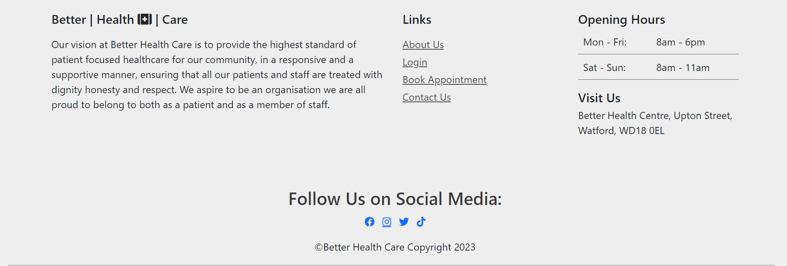

+ The footer contains quite a few links and information for the users
+ Information text to support the user and give a insight on the what the clinic has to offer.
+ Links to navigate around the site are also available to the user. 
+ Opening Hours and closing hours are shown on the footer for users to have clear indication of the clinics timings. 
+ Social media links with clear icons are on the footer for user to navigate and connect the clinics social pages. 
+ A clear header showing "Visit us" is also on the footer, with the address, to make aware to the user the location of the clinic. 

### Site Navigation
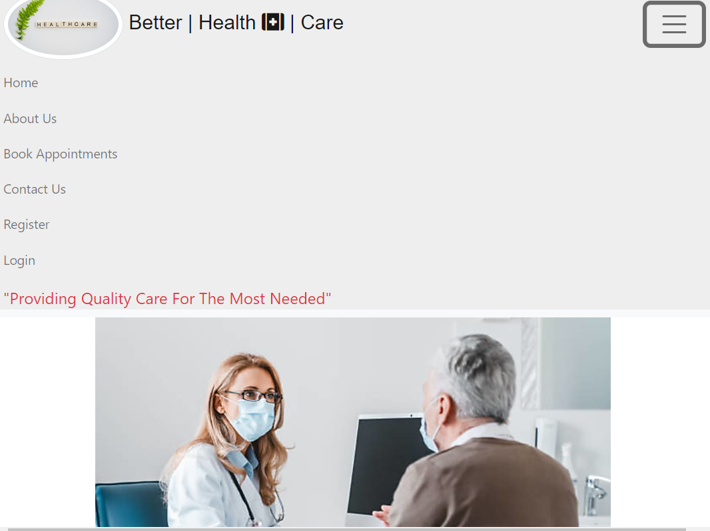


+ Site Navigation is available on both the header and the footer. 
+ On mobile devices the menu icon drops down, and on the full screen desktop devices the navigation bar remains fixed. 
+ The navigation links contain the following features : 
1. Home Page
2. About us Page
3. Book Appointments
4. Conatct Us 
5. Register 
6. Login - Disapears onces Logged in
7. Logout - Appears Once Logged in 
8. Manage Appointments - Appears Once Logged in

### Home Page
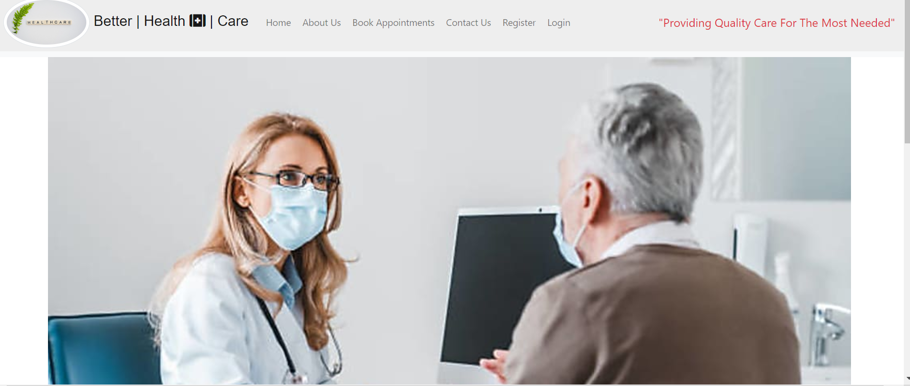

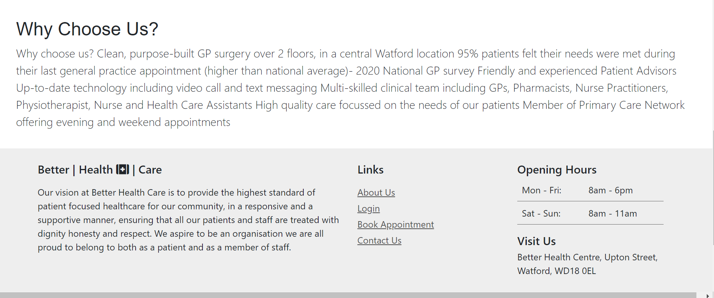

+ The homepage includes a image of a patient and a doctor having a consultation. The image was imported from pexels.com
+ The homepage has some text to reflect to the user as why they should choose the clinic. The text is a small paragraph showing the user data and feature of clinic. 
+ The hompage is a simple page with a good color contrast, it is simple and easy to navigate to other pages.
+ The background color is a white background and the remaining color contrast is of those from the header and footer. 
+ Bootstrap was used to design the Home page with some minor adjustments using internal CSS. 

### About Us Page
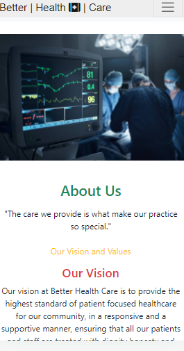
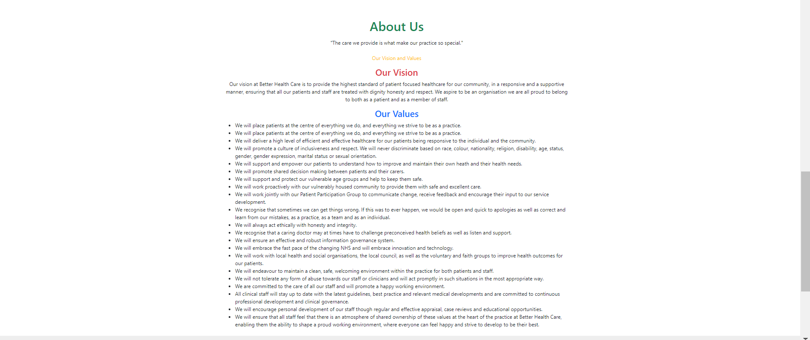


+ The about page was designed to give the user a background and detail of the clinics services and values. 
+ The about page was designed using Bootstrap and the color font was also used using Bootstrap. 
+ The image was a image of a patient under medical care and was imported from pexels.com. 
+ The text was designed using bullets points and gave the user a clear indication of the clinics values and care requirements. 

### Booking Appointment Page (Create Booking)
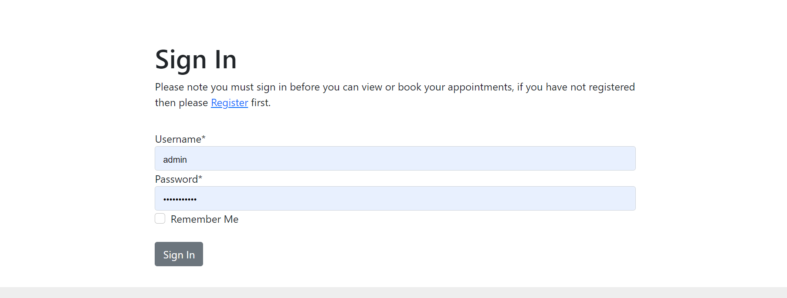
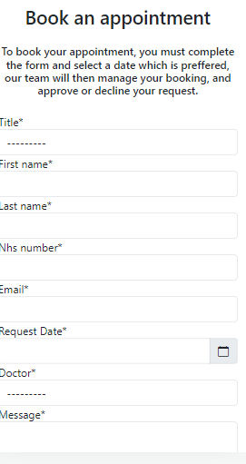

+ The Booking Appointment page does not allow a user to book any appointment untill he/she has signed in. So a user would need to register or sign in before accessing the booking appointment form
+ Once the user has signed they are navigated to the booking form, were they can make a booking. 
+ The booking is a feature which has been imported by using crispy forms, and it also has datepicker facility to select dates using a calender.
+ The booking form has the following fields : <span style="color:red">**All fields are compulsary to fill in, otherwise the user may not proceed further.**</span>
1. Title (Drop down Title option)
2. First Name 
3. Last Name 
4. Nhs Number 
5. Email
6. Request Date (Drop down Calender)
7. Doctor (Drop down Doctor option)
8. Message 
9. Urgent (Drop down urgent option)
+ The Booking form if completed correctly will forward the user to the manage booking page. Otherwise it will request the user to correctly complete all the fields.
+ The user is also sent a  success message once the booking has been created.
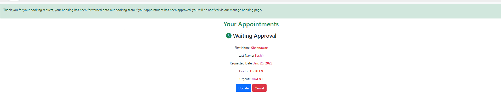

### Manage Appointments Page (Read/View Booking)
<span style="color:blue">**If a appointment has been approved by the admin**</span>
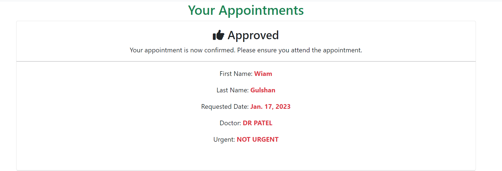

+ So once a user has made a succesful booking, the booking is forwarded onto our manage appointment page. Once the booking has been approved, the approved notification will be displayed to the users, depending if the user is logged in. 
+ A font Awesome thumbs up icon was used to design the approved notification.
+ <span style="color:red">*Your appointment is now confirmed. Please ensure you attend the appointment*</span> This text informs the user that the appointment has been approved and booked in and that they should attend the clinic. 
+ The booking has information on the user,  such as 
1. First Name 
2. Last Name 
3. Requested Date 
4. Doctor 
5. Urgent / Not Urgent 

<span style="color:blue">**If a appointment has been declined by the admin**</span>
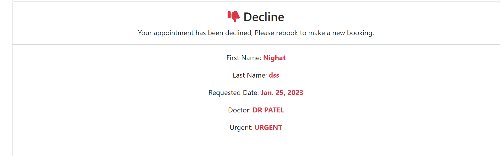

+ So once a user has made a succesful booking, the booking is forwarded onto our manage appointment page. If the  booking has been declined, the decline notification will be displayed to the users, depending if the user is logged in. 
+ A font Awesome thumbs down icon was used to design the decline notification.
+ <span style="color:red">*Your appointment has been declined. Please rebook to make a new booking*</span> This text informs the user that the appointment has been declined and that they should rebook.
+ The booking has information on the user,  such as 
1. First Name 
2. Last Name 
3. Requested Date 
4. Doctor 
5. Urgent / Not Urgent 

<span style="color:blue">**If a appointment has been booked and awaiting approval by the admin**</span>
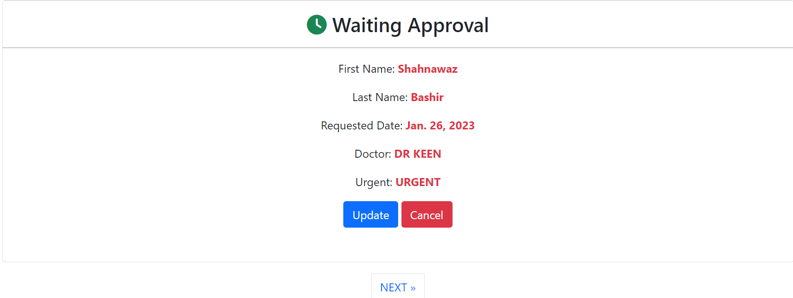

+ So once a user has made a succesful booking, the booking is forwarded onto our manage appointment page. If the booking has not been viewed by the admin, the booking will remain in it's orginal waiting approval stage, this is depending if the user is logged in. 
+ A font Awesome clock icon was used to design the waiting-approval notification.
+ The booking has information on the user, such as 
1. First Name 
2. Last Name 
3. Requested Date 
4. Doctor 
5. Urgent / Not Urgent 
+ While the booking is in waiting approval stage the user has got the chance to update the booking or cancel the booking. 
+ The user is also offered a pagination of 3 booking history per page. Which they can access by pressing the next or previous button.
+ The user is unable to make any further bookings while they have a waiting approval appointment in the manage appointments page. They will only be allowed to rebook once they have a "approved" or "decline" status.

### Update Booking Page (Update Booking)
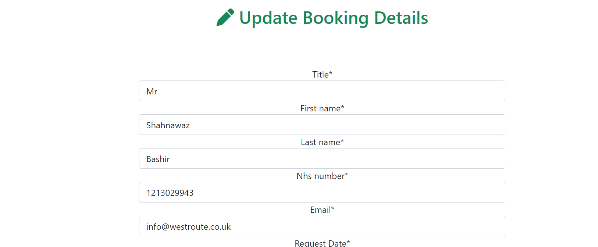

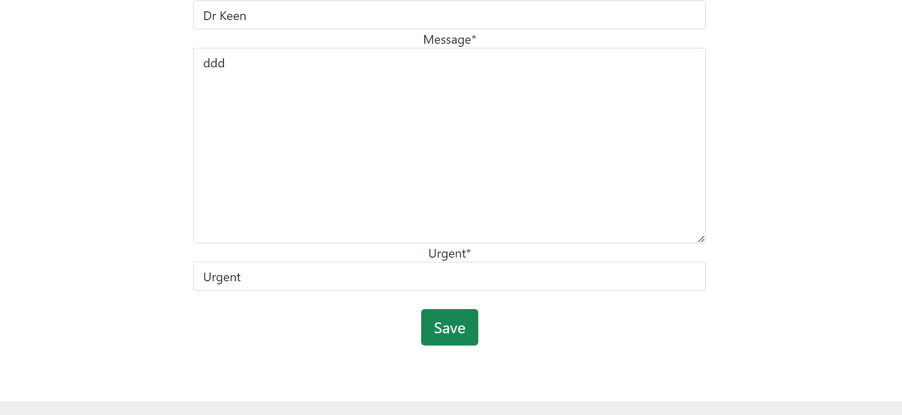

+ The update appointment page will bring up your bookings, which was orginally submitted by the user on the booking appointment page. The information they entered will have been saved and ready for editing only. 
+ Once the changes have been updated and saved, the bookign will back to the manage appointment page awaiting approval from the admin.
+ A feature which was added, was the disabled fields. This was introduced so that the user could not ammend all the fields, which would in return be difficult for the admin to cross check the user with the original booking. 

### Delete Booking Page (Delete Booking)
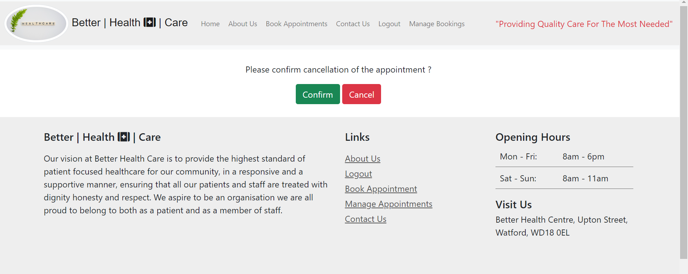

+ The delete booking page will have two buttons, and request the user as to whether they would confirm cancelling the booking, confirm cancellation will be a green button and cancel cancellation request will be a red button. 
+ The booking once cancelled will be removed from the users manage appointments database and also from the admin database. 

<span style="color:blue">**If a appointment has been deleted then no bookings will show in the manage appointment page**</span>
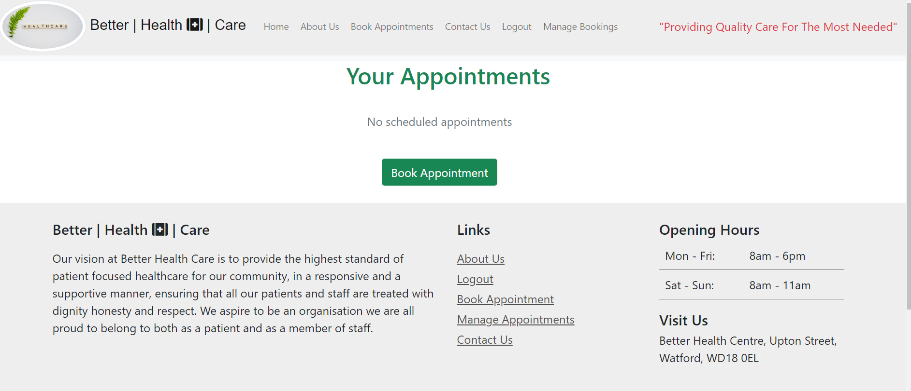

### Contact Us Page
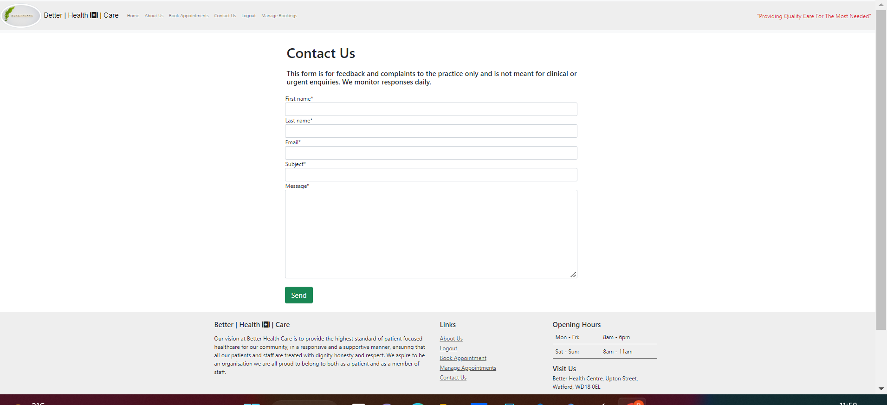

+ The contact us page, was created for feedback and complaints users may have about the clinic. 
+ The form allows the user to engage with the clinic so feedback can be forwarded on to relevant parties. 
+ The form is a simple form which allows the user to enter his/her details and submit it to the admin. 
+ The form is then viewed by the admin and acted on accordingly. 
+ The form contains the following compulsary fields. 
1. First Name 
2. Last Name 
3. Email
4. Subject
5. Message 

+ Once the form has been completed it can be sent to the admin. 
+ The user is displayed with a success alert message, which dissapear after a few seconds and returns a blank form.
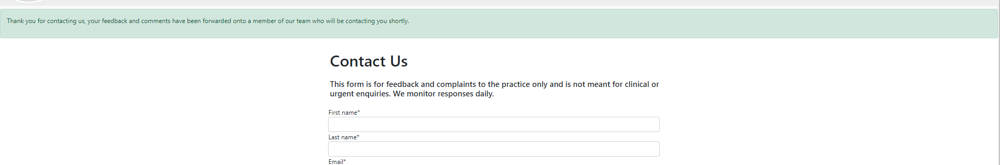

### Sign In / Login
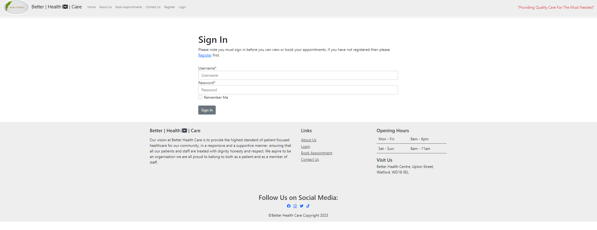

+ All existing users will need to sign into the site before they are allowed to book any appointments. 
+ Existing users may click the remember me tab, so they do not have to keep entering their details to view or make bookings. 
+ The sign in page allows users to signin or register if they are a new user.

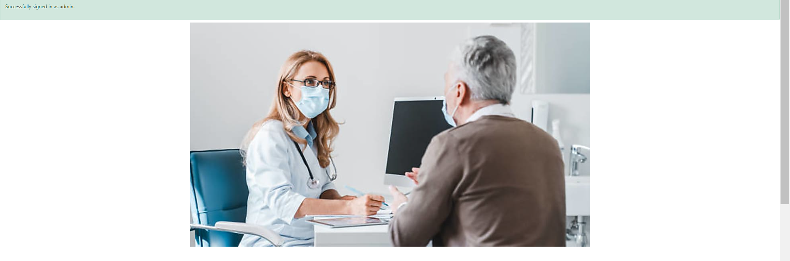

+ The user is greated with a message "succesfully signed in as {First_name}" 

### Register


+ The register page allows users to register if they are a new user. 
+ The fields that are compulsary to complete are : 
1. Username
2. Password
3. Password(again)
4. Email (optional)
+ Once completed the user may sign in and create bookings. 

### Logout

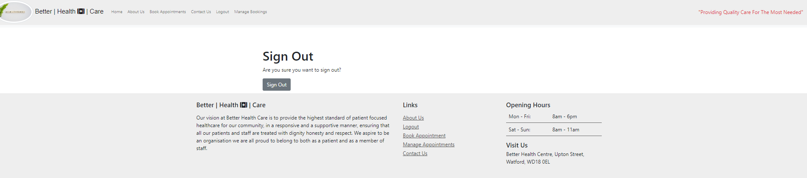

+ The user is displayed a message confirming they would like to sign out. 
+ If signed out is confirmed the user is signed out and restricted from viewing or creating any bookings.

## Admin Model 
<span style="color:blue">**The Admin sign in page**</span>
+ The Django Adminstration page requests the user to login 
+ The admin login is created by creating a superuser from the terminal
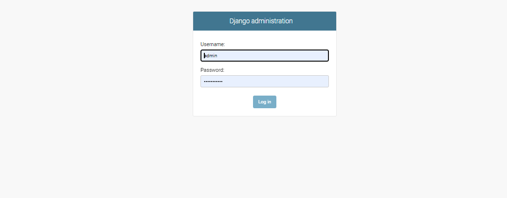

<span style="color:blue">**The Admin Model**</span>
+ The admin models contains a list of created models in the app. 
+ The admin models have a list of action of data which has been inputed by the user.
+ Admin users have more functionality than regular users and have full CRUD functionality over information such as users and bookings. 
+ Only approved admin users can access this section of the site. It is accessed by adding /admin to the URL home page and signing in.
+ The admin models have all user information, which was entered during sign in and Book Appointments. 
+ Bookings and users can be deleted by the admin. 
+ Bookings can be approved and declined by the user. 
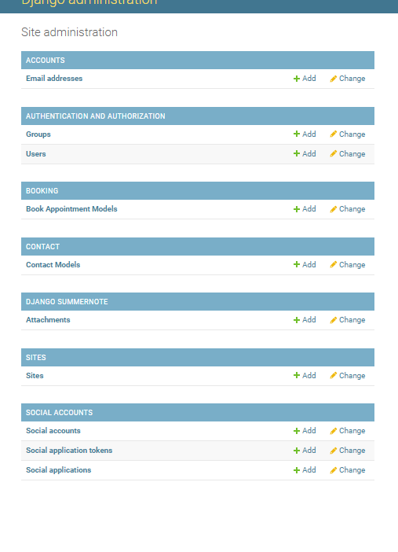

## Future Features 
While creating the Project, I realised that the vast input I could add to the design to allow it to have more functionalities. As we have all learnt the timescope involved limits the overall scope. 

<span style="color:blue">**What I can add as a Future Feature**</span>
+ Send a user a confirmation email once a registration has been made. 
+ Send a user a confirmation email once a booking has been made. 
+ Send a user a confirmation email once the admin has made any correspondence with the bookings, i.e Approved or decline. 
+ Allow the user to describe his illness to the doctor and for the admin i.e doctor to reply back to patients with treatments or remiedies. 
+ Sms Notifications updates and confirmations. 

## Testing 
All of the testing and validation for the project can be viewed here [Testing and Validation](Testing.md)


## Technologies
+ HTML - for the structure of the website
+ CSS - to provide styling to the page.
+ JavaScript - not used at the moment for this project.  
+ Python - to write all the logic of the app
+ Django - used as main framework for the app, which both all backend and most frontend elements are built on.
+ Django-allauth: for handing all user models and login functionality.
+ Cloudinary: for saving images in cloudinary and serving them to the client.
+ Django-crispy-forms: for making the django forms look better.
+ ElephantSQL - used to manage a PostgreSQL database.
+ Bootstrap - Widely used for the design of the site
+ Jquery - to allow some functions to delay or prompt messages. 
+ Lucidchart used to make a database diagram.
+ Gitpod - used to connect a browser based VScode to github.
+ Github - used for version control and deployment of the website.
+ Heroku - to deploy the app.
+ PEP8 Online Checker - Check all Python code and ammend errors and warnings. 
+ JShint - used to validate javascript/Jquery.
+ NuHtmlChecker - used to validate HTML.
+ W3C Jigsaw - CSS checker.
+ Lighthouse - To check the following aspects of a URL: Performance, Progressive Web App, Accessibility, Best Practices and SEO.
+ Google Developer Tools - to view pages on different media screens and ammend changes as developing. 
+ Balsamiq Wireframes
+ Responsive design
+ HTML Viewer - Code Beautify


### Libraries
#### Libraries/Module Installed
+ asgiref==3.6.0
+ bootstrap4==0.1.0
+ click==8.1.3
+ cloudinary==1.30.0
+ dj-database-url==1.2.0
+ dj3-cloudinary-storage==0.0.6
+ Django==3.2.16
+ django-allauth==0.52.0
+ django-bootstrap-datepicker-plus==5.0.2
+ django-crispy-forms==1.14.0
+ django-phone-field==1.8.1
+ django-summernote==0.8.20.0
+ django-widget-tweaks==1.4.12
+ Flask==2.2.2
+ gunicorn==20.1.0
+ itsdangerous==2.1.2
+ oauthlib==3.2.2
+ psycopg2==2.9.5
+ pydantic==1.10.4
+ PyJWT==2.6.0
+ python3-openid==3.2.0
+ pytz==2022.7
+ requests-oauthlib==1.3.1
+ sqlparse==0.4.3
+ Werkzeug==2.2.2

## Security Features and Defensive Design
### User authentication
+ Django's all auth was used for login and sign up functionality.
+ Django's superuser is used to limit access to admin panel.

### Form Feature & Validation
+ Crispy Form was used for the front end. 
+ Extensive form validation is used on front end as well as backend.

### Database Security
All secret keys connecting to the database are stored in a env.py file that is never pushed to github. Furthermore, Cross-Site Request Forgery (CSFR) tokens were used on all forms throughout the project.

## Deployment
### Local Deployment
To test the app locally, we took the following steps : 

+ In your project workspace folder, open a terminal
+ Run the command: python3 manage.py runserver
+ Hit the 'open browser' button or visit http://localhost:8000/ in the browser.
+ Open the browser and view the page.

### Heroku Deployment Initial Stage (As advised by Code Institute)
Before starting work, the project was deployed to Heroku. This was done early in the process, to prevent having to deal with difficulties of deployment close to the project deadline. The following steps needed to be performed:

+ Go to the Heroku's website.
+ Create an account if required or select log in.
+ From the Heroku dashboard, click on the “New” button in top righthand corner then "Create new app".
+ Enter a unique "App name" and "Choose a region" before clicking on "Create app".
+ Go to "Config Vars" under the "Settings" tab.
+ Click on "Reveals Config Vars" and enter the following information:
+ CLOUDINARY_URL : add your cloudinary key here.
+ DATABASE_URL : add the url from postgres database.
+ SECRET_KEY = a secret key for your app.
+ PORT : 8000
+ DISABLE_COLLECTSTATIC = 1 during development (Remove when deploying production!)
+ Go to "Buildpacks" section and click "Add buildpack".
+ Select "/herokupython" and click "Save changes"
+ Go to "Deployment method", under the "Deploy" tab select "GitHub" and click on "Connect to GitHub".
+ Go to "Connect to GitHub" section and "Search" the repository to be deployed.
+ Click "Connect" next the repository name.
+ Choose "Automatic deploys" or "Manual deploys" to deploy your application.

### PostgreSQL database: (ElephantSQL)
+ Log in to the ElephantSQL account 
+ Click "Create New Instance"
+ Set your plan, select Tiny Turtle Plan, leave tag field blank
+ Click on "Select Region" 
+ Click "Review"
+ Return to the ElephantSQL dashboard, and click on the database instance name for this project
+ Copy your ElephantSQL database Url 

### Github
+ To make my project I used gitpod worskspace, where first save all the files.
+ Then in the terminal type git add . to add all the changes inside the staging area.
+ The next step was git commit -m "changes I made" where I confirmed that what changes I want to make.
+ Last but not least, I have typed git push to save everything on Github.

## Credits
A list of my credits are below

+ Code Institue Learning guide and past coding examples
+ Django Blog
+ Testing Module for Code Institue
+ Learn Django Youtube
+ Learn Python, Youtube
+ Python Automated Testing - Youtube
+ W3schools.com - Help with Python coding.
+ stackoverflow.com - help with coding, by visiting past forums.
+ Slack - support from colleagues and mentors
+ Thorin - Flask Walkthrough Project for Bootstrap ideas
+ Pexels.com for Images 
+ Watford Health Centre - Images and text designs 
+ Django Framework Documentation. 
+ Bootstrap Documentation
+ Other Health Centre clinics websites.


## Acknowledgement
+ My mentor Rohit Sharma @rohit_mentor - Great advice and support throughout my project journey, I was guided well with plenty of advise and support.
+ Tutor Suport - So much help from a wide diversity of tutors. They were able to support me in good time and made me realise when things became difficult.
+ Slack - Always so much help from colleagues, the level of support is undoubtedly amazing.
