# Project 4 - Better | Health | Care - A Online Booking System for Patients.

## Table of content

+ Validation Testing 
    + HTML
        + [NU-HTML-CHECKER](#html-testing-using-nu-html-checker)
    + CSS
        + [W3-JIGSAW.ORG](#css-validator-using-jigsaww3)
    + Javascript 
        + [JShint](#javascript--jquery-using-jshint)
    + Python Pep8 Online Checker
        + Main App - [URLs](#main-app---better-health-care---urls-file)
        + Booking App - [Admin File](#booking-app---admin-file)
        + Booking App - [Form File](#booking-app---form-file)
        + Booking App - [Urls File](#booking-app---urls-file)
        + Booking App - [Views File](#booking-app---views-file)
        + Contact App - [Urls File](#contact-app---urls-file)
        + Contact App - [Forms File](#contact-app---form-file)
        + Contact App - [Models File](#contact-app---models-file)
        + Contact App - [Views File](#contact-app---views-file)

    
+ Lighthouse Testing 
    + [Home Page](#lighthouse-testing---home-page)
    + [About Us Page](#lighthouse-testing---about-us-page)
    + [Booking Appointment Page](#lighthouse-testing---booking-appointment-page)
    + [Manage Booking Page](#lighthouse-testing---manage-appointment-page)
    + [Contact Us Page](#lighthouse-testing---contact-us-page)

+ [Browser Testing](#browser-testing)
+ [Device Testing](#device-testing)
+ [Manual Testing](#manual-testing)
    + [Home Page](#home-page)
    + [About Us Page](#about-us-page)
    + [Booking Appointment Page](#booking-appointment-page)
    + [Manage Appointment Page](#manage-appointment-page)
    + [Update Appointment Page](#update-appointment-page)
    + [Delete Appointment Page](#delete-appointments-page)
    + [Contact Us Page](#contact-us-page)
    + [Login Page](#login-page)
    + [Register Page](#register-page)
    + [Logout Page](#logout)
    + [Django Admin Page](#admin-page)
    + [404 Error Page](#404-error-page)

+ [Bugs](#bugs)
    + [Fixed Bugs](#fixed-bugs)
    + [Unfixed Bugs](#unfixed-bugs)

## Testing & Validation Checks 

### HTML Testing using NU-HTML-CHECKER

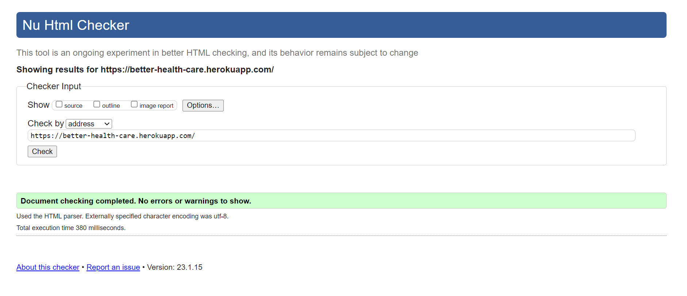

+ All my pages was checked via nu-html-checker, initally i got 38 errors, mostly due to unclosed div tags or stray tags, these were quickly rectified and the code was rechecked and recieved no errors or warnings. 

### CSS Validator using JIGSAW.W3

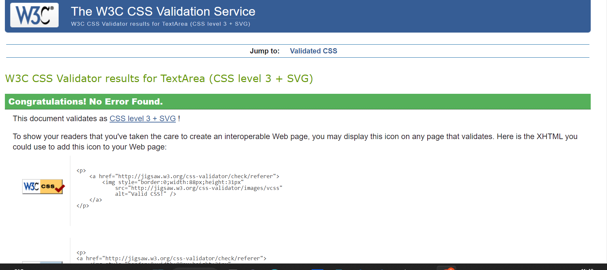

+ All my CSS was checked via Jigsaw W3.org, luckily I received no errors or warnings.  

### Javascript & JQuery using JSHINT 

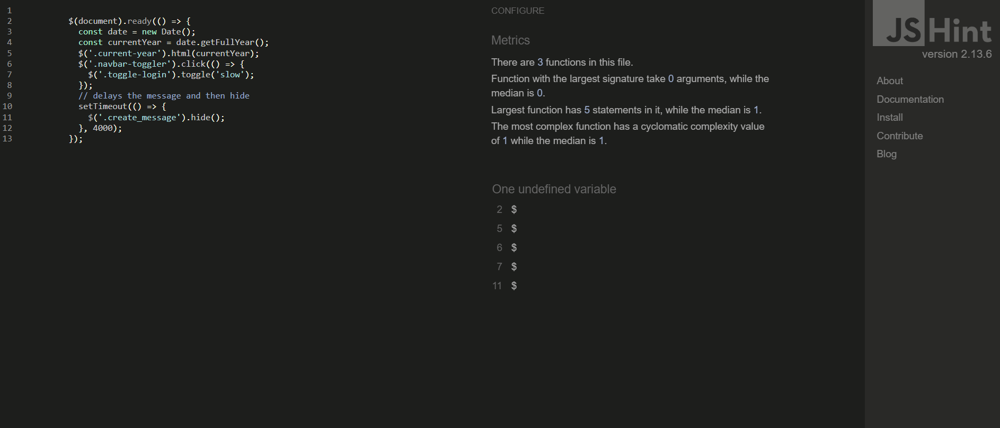

+ Although I did not have much Javascript, the code that I did have was checked on Jshint, by pasting the code in. I did initially have 8 warnings, as my code required semi-colons, this was rectified and the code was retested, and received no errors. I did however receive One undefined variable but checking with tutor support that this was because of the jquery and has no bearing affect to the validation

### Python - PEP8 Online checker (Code Institute Version)

#### Main App - Better Health Care - Urls File
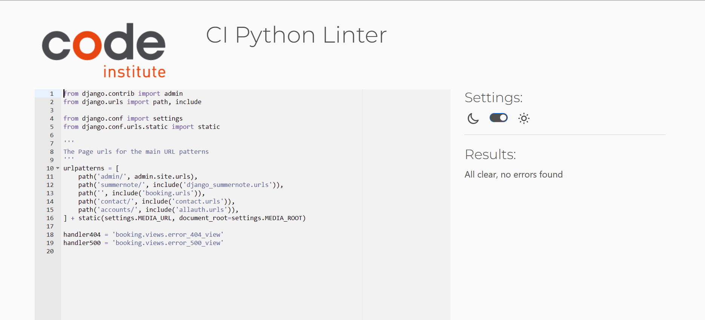

+ A few initial errors on testing from the line being too long and having additional whitespaces. These were all rectified and the code was retested, and received no errors.

#### Booking App - Admin File

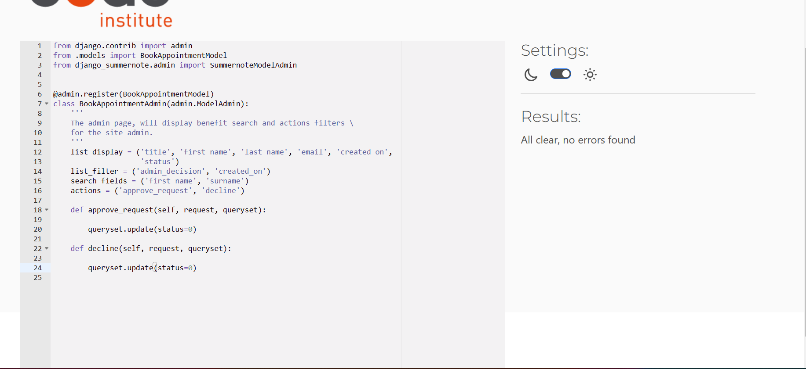

+ A few initial errors on testing from the line being too long and having additional whitespaces. These were all rectified and the code was retested, and received no errors.

#### Booking App - Form File
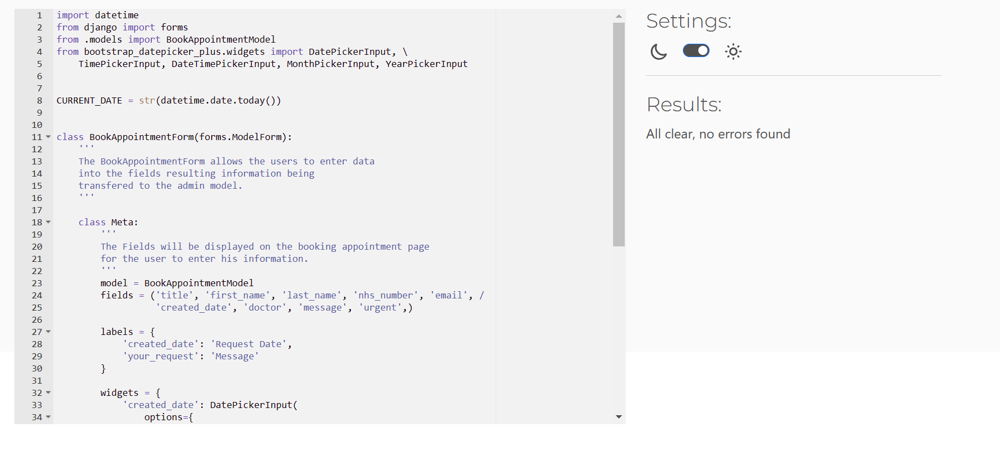

+ A few initial errors on testing from the line being too long and having additional whitespaces. These were all rectified and the code was retested, and received no errors.

#### Booking App - Urls File
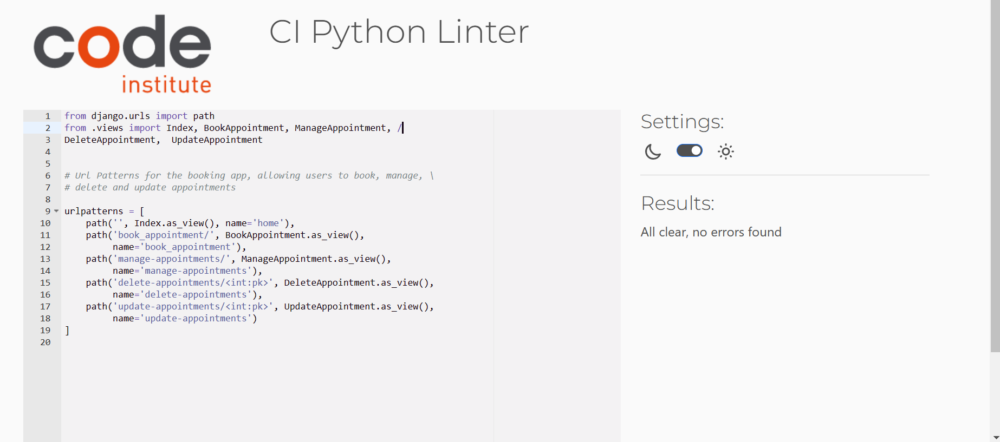

+ A few initial errors on testing from the line being too long and having additional whitespaces. These were all rectified and the code was retested, and received no errors.

#### Booking App - Views File

+ A few initial errors on testing from the line being too long and having additional whitespaces. These were all rectified and the code was retested, and received no errors.

#### Contact App - Urls File
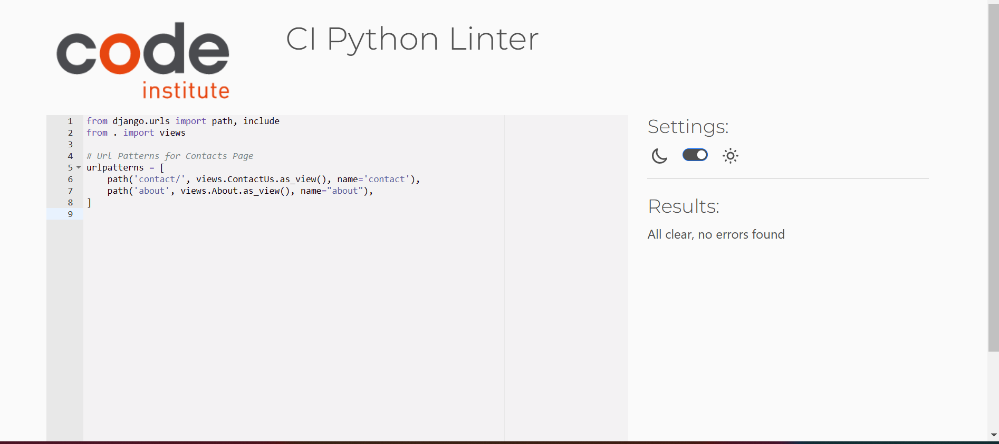

+ A few initial errors on testing from the line being too long and having additional whitespaces. These were all rectified and the code was retested, and received no errors.

#### Contact App - Form File
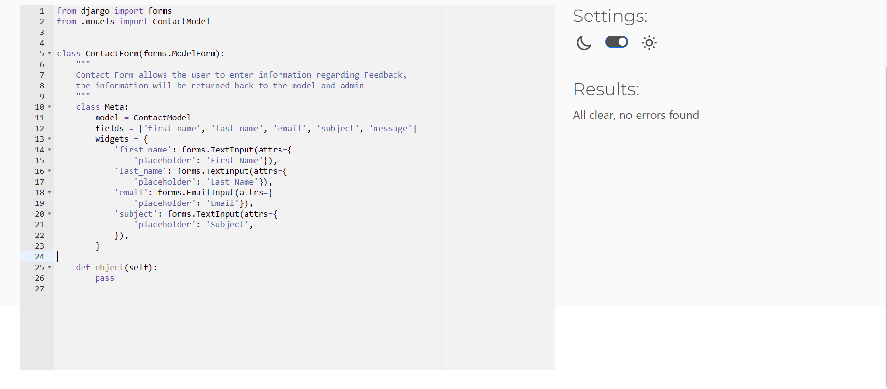

+ A few initial errors on testing from the line being too long and having additional whitespaces. These were all rectified and the code was retested, and received no errors.

#### Contact App - Models File
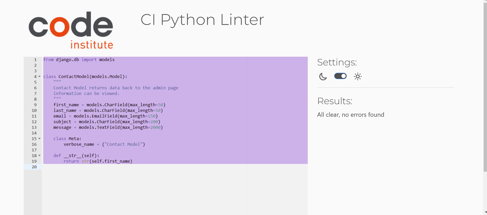

+ A few initial errors on testing from the line being too long and having additional whitespaces. These were all rectified and the code was retested, and received no errors.

#### Contact App - Views File
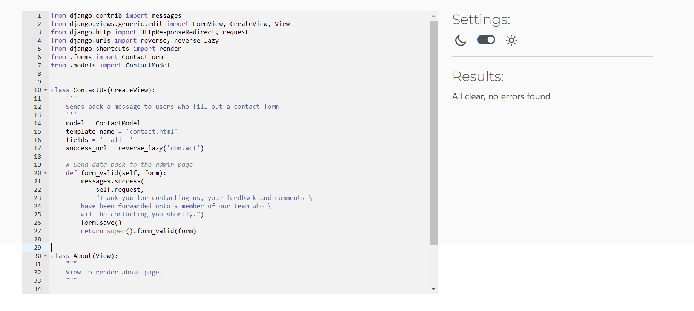

+ A few initial errors on testing from the line being too long and having additional whitespaces. These were all rectified and the code was retested, and received no errors.

## Lighthouse Testing 

#### Lighthouse Testing - Home Page
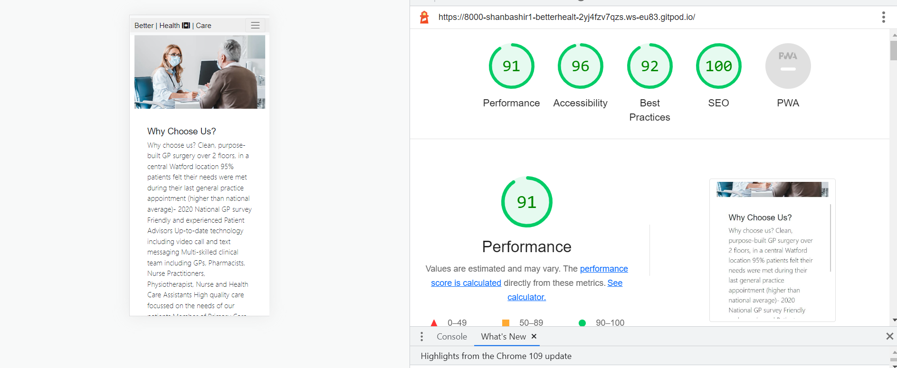

+ The test were carried out by using the Lighthouse checker, which evaluates and scores the site on the following categories: 
    + Performance
    + Accessbility
    + Best Practice
    + SEO

+ Lighthouse can be accessed from the google dev tools page.
#### Lighthouse Testing - About Us Page
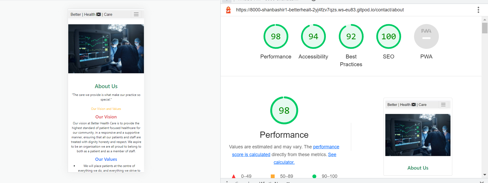

#### Lighthouse Testing - Booking Appointment Page
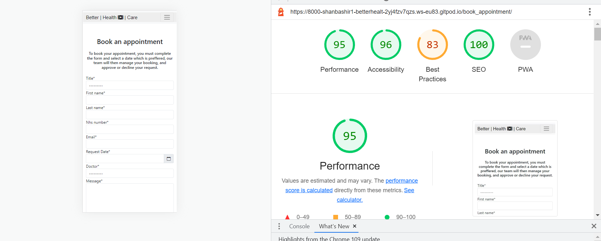

#### Lighthouse Testing - Manage Appointment Page
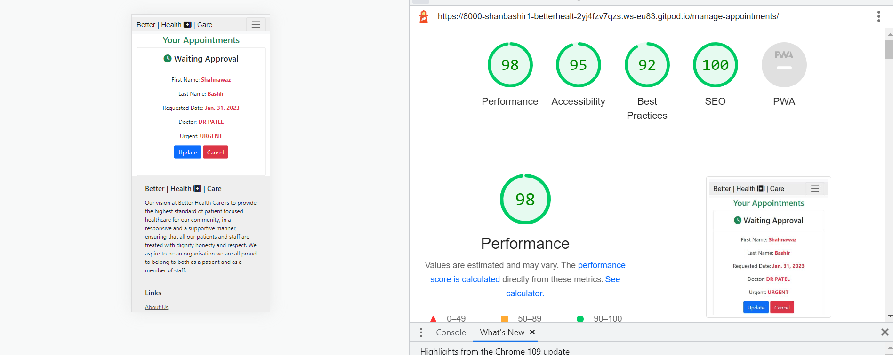

#### Lighthouse Testing - Contact Us Page
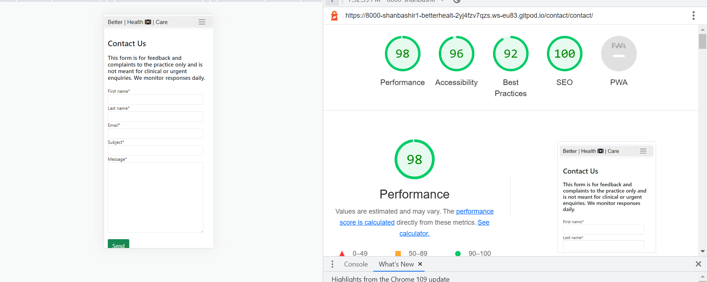

## Browser Testing 
The project was tested extensively on Google Chrome and Safari browsers, where no browser compatibility issues came up.

## Device Testing 
The project was tested on a multitude of devices: several iPhones, android phones, linux laptops and Macbook Pro. The website was properly responsive on all devices.

## Manual Testing 

#### Home Page 

| Element                    | Location       | Action          | Expected Result               | Pass/Fail |
| -------------------------- | -------------- | --------------- | ----------------------------- | --------- |
| Site Logo                  | Navigation Bar | Click           | Redirect to home page        | Pass      |
| Header Text                | Navigation Bar | Click           | Redirect to home page         | Pass      |
| Home Page Link             | Navigation Bar | Click           | Redirect to home page         | Pass      |
| About Us Page Link         | Navigation Bar | Click + Display | Open About Us Page            | Pass      |
| Book Appointment Page Link | Navigation Bar | Click + Display | Open Booking Appointment Page | Pass      |
| Contact Us Page Link       | Navigation Bar | Click + Display | Open Contact Us Page          | Pass      |
| Register Page              | Navigation Bar | Click + Display | Open Register Page            | Pass      |
| Login Page                 | Navigation Bar | Click + Display | Open Login Page               | Pass      |
| About Us Page Link         | Footer         | Click + Display | Open About Us Page            | Pass      |
| Login Page                 | Footer         | Click + Display | Open Login Page               | Pass      |
| Book Appointment Page Link | Footer         | Click + Display | Open Booking Appointment Page | Pass      |
| Contact Us Page Link       | Footer         | Click + Display | Open Contact Us Page          | Pass      |
| Facebook Link              | Footer         | Click + Display | Open Facebook Page            | Pass      |
| Instagram Link             | Footer         | Click + Display | Open Instagram Page           | Pass      |
| Twitter Link               | Footer         | Click + Display | Open Twitter Page             | Pass      |
| TikTok Link                | Footer         | Click + Display | Open TikTok Page              | Pass      |

#### About Us Page
The About page did not consist of any testing methods as it contained the same feature as the Home Page. 

#### Booking Appointment Page

| Element            | Location                 | Action          | Expected Result                                                                | Pass/Fail |
| ------------------ | ------------------------ | --------------- | ------------------------------------------------------------------------------ | --------- |
| Sign In            | Booking Appointment Page | Click           | Request user to sign in / Register                                             | Pass      |
| If \_ Signed \_ In | Booking Appointment Page | Display         | Booking Form                                                                   | Pass      |
| Once_Signed_In     | Booking Appointment Page | Success Message | Succesfully signed in as {first_name}                                          | Pass      |
| Title              | Booking Appointment Form | Display Choices | 1\. Drop down title choices. 2. Field fill in compulsary                       | Pass      |
| First Name         | Booking Appointment Form | Insert Data     | 1\. Field fill in compulsary                                                   | Pass      |
| Last Name          | Booking Appointment Form | Insert Data     | 1\. Field fill in compulsary                                                   | Pass      |
| Nhs Number         | Booking Appointment Form | Insert Data     | 1\. Field fill in compulsary 2. Max-Length =10 digits                          | Pass      |
| Email              | Booking Appointment Form | Insert Data     | 1\. Field fill in compulsary                                                   | Pass      |
| Request Date       | Booking Appointment Form | Calender Picker | 1\. Field fill in compulsary 2. Pop of calender 3. No Past date to be selected | Pass      |
| Doctor             | Booking Appointment Form | Display Choices | 1\. Drop down title choices. 2. Field fill in compulsary                       | Pass      |
| Message            | Booking Appointment Form | Insert Data     | 1\. Field fill in compulsary                                                   | Pass      |
| Urgent             | Booking Appointment Form | Display Choices | 1\. Drop down title choices. 2. Field fill in compulsary                       | Pass      |
| Book Button        | Booking Appointment Page | Click + Display | 1\. Submit form 2. Redirect to Manage Appointments                             | Pass      |
| Book Button        | Manage Appointment       | Success Message | Thank you for your booking                                                     | Pass      |

#### Manage Appointment Page

| Element   | Location           | Action           | Expected Result                                                 | Pass/Fail |
| --------- | ------------------ | ---------------- | --------------------------------------------------------------- | --------- |
| Main Page | Manage Appointment | View             | Display appointment made by user                                | Pass      |
| Main Page | Manage Appointment | Waiting Approval | Display Update and Cancel buttons                               | Pass      |
| Main Page | Manage Appointment | Update Button    | Redirect to update appointment page                             | Pass      |
| Main Page | Manage Appointment | Cancel Button    | Redirect to delete appointment page                             | Pass      |
| Main Page | Manage Appointment | Decline          | Display appointment and text confirming decline                 | Pass      |
| Main Page | Manage Appointment | Approved         | Display appointment and text comfirming approval                | Pass      |
| Main Page | Manage Appointment | Site Pagination  | Display 3 bookings per page with both next and previous options | Pass      |

#### Update Appointment Page

| Element   | Location                | Action            | Expected Result                                               | Pass/Fail |
| --------- | ----------------------- | ----------------- | ------------------------------------------------------------- | --------- |
| Main Page | Update Appointment Page | View              | View appointment which has been booked by user                | Pass      |
| Main Page | Update Appointment Page | Edit              | Edit exisiting appointment                                    | Pass      |
| Main Page | Update Appointment Page | Restricted Fields | Only request date, message and Urgent field to be ammended    | Pass      |
| Main Page | Update Appointment Page | Restricted Fields | The remaining fields to be disabled and unable to be edited   | Pass      |
| Main Page | Update Appointment Page | Save Button       | Save button to update changes and redirect to Manage bookings | Pass      |

#### Delete Appointments Page 

| Element   | Location                | Action             | Expected Result                                                      | Pass/Fail |
| --------- | ----------------------- | ------------------ | -------------------------------------------------------------------- | --------- |
| Main Page | Delete Appointment Page | View               | View delete page and confirmation with buttons confirm and cancel    | Pass      |
| Main Page | Delete Appointment Page | Cancel Button      | Cancel's request and redirects user back to manage appointments page | Pass      |
| Main Page | Delete Appointment Page | Confirm            | Delete's booking from manage appointments and admin page             | Pass      |
| Main Page | Manage Appointment Page | Confirmed deletion | No appointments dispalyed on Manage appointments page                | Pass      |

#### Contact Us Page

| Element     | Location        | Action           | Expected Result                                                              | Pass/Fail |
| ----------- | --------------- | ---------------- | ---------------------------------------------------------------------------- | --------- |
| First Name  | Contact Us Page | Insert Data      | 1\. Field fill in compulsary                                                 | Pass      |
| Last Name   | Contact Us Page | Insert Data      | 1\. Field fill in compulsary                                                 | Pass      |
| Email       | Contact Us Page | Insert Data      | 1\. Field fill in compulsary                                                 | Pass      |
| Subject     | Contact Us Page | Insert Data      | 1\. Field fill in compulsary                                                 | Pass      |
| Message     | Contact Us Page | Insert Data      | 1\. Field fill in compulsary                                                 | Pass      |
| Send Button | Contact Us Page | Click, Send data | Once information has been submitted correctly the form is sent to Admin Page | Pass      |
| Send Button | Contact Us Page | Success Message  | Thank you for your feedback message                                          | Pass      |

#### Login Page

| Element        | Location     | Action          | Expected Result                                 | Pass/Fail |
| -------------- | ------------ | --------------- | ----------------------------------------------- | --------- |
| Username       | Sign In Page | Insert Data     | 1\. Field fill in compulsary                    | Pass      |
| Password       | Sign In Page | Insert Data     | 1\. Field fill in compulsary                    | Pass      |
| Remember me    | Sign In Page | Tick Option     | Able to tick to remember login details          | Pass      |
| Once_Signed_In | Home Page    | Success Message | You have successfully signed in as {first_name} | Pass      |

#### Register Page

| Element         | Location      | Action           | Expected Result                                                              | Pass/Fail |
| --------------- | ------------- | ---------------- | ---------------------------------------------------------------------------- | --------- |
| Username        | Register Page | Insert Data      | 1\. Field fill in compulsary                                                 | Pass      |
| Email           | Register Page | Insert Data      | 1\. Field fill in optional                                                   | Pass      |
| Password        | Register Page | Insert Data      | 1\. Field fill in compulsary                                                 | Pass      |
| Password(again) | Register Page | Insert Data      | 1\. Field fill in compulsary - same as password                              | Pass      |
| Sign Up Button  | Register Page | Click, Send data | Once information has been submitted correctly the form is sent to Admin Page | Pass      |
| Once_Registered | Home Page     | Success Message  | Success message and keep user signed in                                      | Pass      |

#### Logout
| Element         | Location    | Action          | Expected Result                       | Pass/Fail |
| --------------- | ----------- | --------------- | ------------------------------------- | --------- |
| Main Page       | Logout Page | View            | Display logout page confirmation      | Pass      |
| Sign Out Button | Logout Page | Click + Logout  | Log user out                          | Pass      |
| Sign Out Button | Logout Page | Success Message | Successfully Logged out               | Pass      |
| Sign Out Button | Home Page   | Home Page       | Redirect to Home page once logged out | Pass      

#### Admin Page

+ Sign in page for Admin
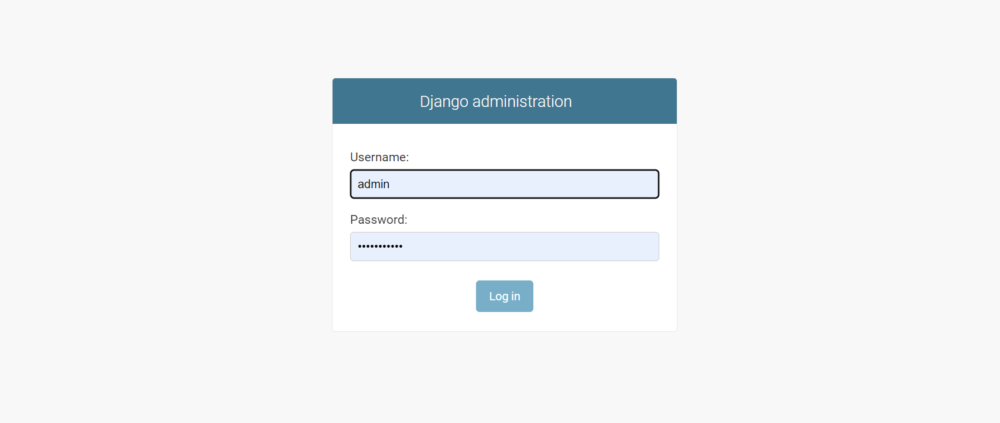|

+ Booking Appointment database in Admin
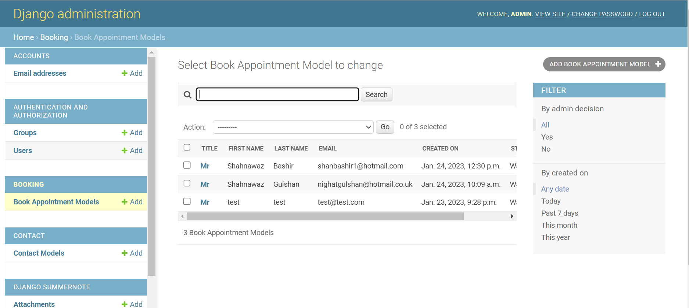|

+ Contact us Form database in Admin
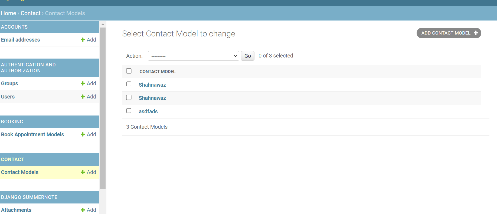|

| Element                 | Location                  | Action             | Expected Result                                                            | Pass/Fail |
| ----------------------- | ------------------------- | ------------------ | -------------------------------------------------------------------------- | --------- |
| Sign In                 | Admin Page                | View               | Requests the admin to sign in                                              | Pass      |
| Sign \ \_ In \ \_ Admin | Home Page Admin           | View               | View all models and recent actions                                         | Pass      |
| Users                   | Home Page Admin           | Users              | New registered users  to be displayed in database                          | Pass      |
| Booking Appointment     | Home Page Admin           | Bookings           | Appointments booked displayed  in database                                 | Pass      |
| Booking Appointment     | Booking Appointment Admin | Send user requests | Decline or Approve appointments to viewed back in users manage appointment | Pass      |
| Booking Appointment     | Booking Appointment Admin | Delete             | Delete bookings from admin, which automatically deletes users booking      | Pass      |
| Booking Appointment     | Booking Appointment Admin | Create             | Be able to create bookings                                                 | Pass      |
| Contact Us              | Contact Us Admin          | View               | Be able to view customers feedback and information                         | Pass      |
| Contact Us              | Contact Us Admin          | Delete             | Be able to delete contact us feedback from users.                          | Pass      |
| Logout                  | Home Page Admin           | Logout             | Be able to logout successfully                                             | Pass      |

#### 404 Error Page

| Element           | Location | Action          | Expected Result                                                                       | Pass/Fail |
| ----------------- | -------- | --------------- | ------------------------------------------------------------------------------------- | --------- |
| Page not found    | 404 Page | View            | Any page not recognised or typing error the page will direct the user to the 404 page | Pass      |
| Url error         | 404 page | view            | Any URL not correctly displayed will take the user to the 404 page                    | Pass      |
| Home Page Buttton | 404 page | Click + Display | The home page button redirects the user from the 404 page back to the home page       | Pass      |

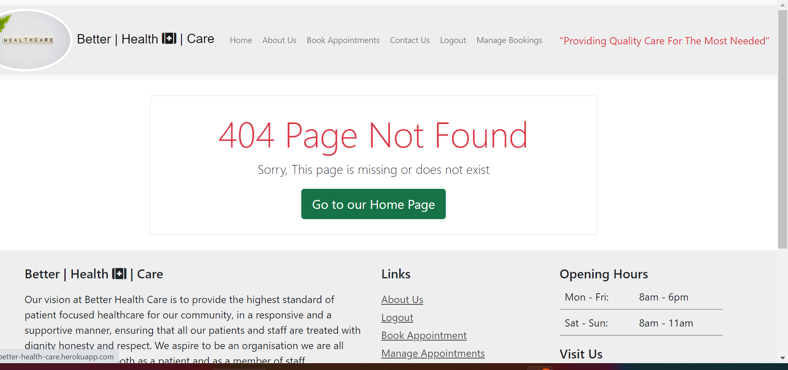|

## Bugs 

### Fixed Bugs 
| Element | Location            | Action         | Expected Result                                                                    | Pass/Fail |
| ------- | ------------------- | -------------- | ---------------------------------------------------------------------------------- | --------- |
| Bug     | Update Booking Page | Disbale Fields | To disable the First Name, Last Name, Email, Nhs Number, Doctor fields for editing | Pass      |

+ This particular bug was realised during testing. I realised that all my fields could be ammended including the name of the patient, which became difficult for an admin to realise the original booking user. I had to put in a defensive line of code and so I added a disabled field onto the forms.py which restricted the fields when making changes to existing bookings. 

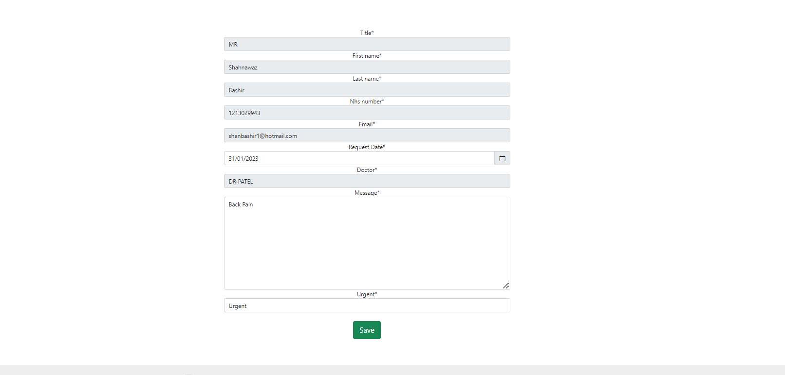

| Element | Location            | Action               | Expected Result                                                 | Pass/Fail |
| ------- | ------------------- | -------------------- | --------------------------------------------------------------- | --------- |
| Bug    | Update Booking Page | Authentication error | No other user to be able to access any other users booking page | Pass      |

+ The issue with the following bug was that any user was able to add a exisiting booking number to update-appointment and access it i.e url followed by update-appointment/7 or update-appointment/8 etc. This was a authentication error and serious error/bug that had to be rectified as other user were able to see each others appointments and data. The issue was eventually rectified with some defensive code in my booking app, view.py file, Class updateAppointments section, this restricted any user not assigned to the booking to change the url and view another users booking. If they tried to view a booking not belonging to them the user would receive a message informing them that they do not have access to this booking. 

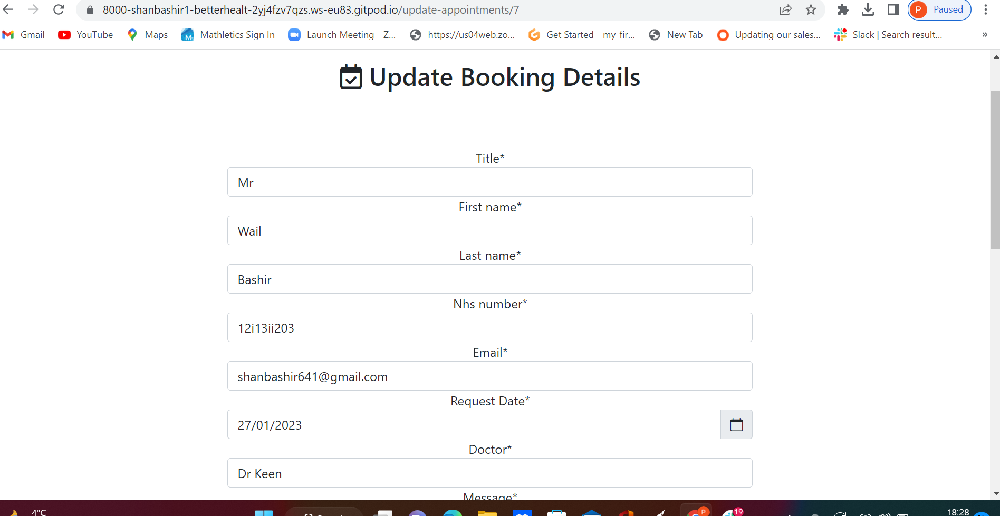

+ After the bug issue has been resolved, the user is alerted a error message and redirected to the manage booking page. 

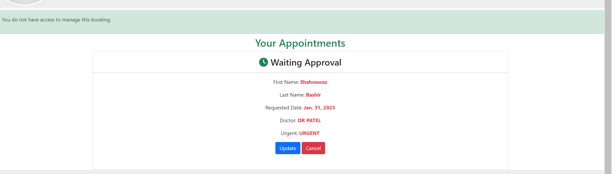

| Element | Location                 | Action               | Expected Result                                                                      | Pass/Fail |
| ------- | ------------------------ | -------------------- | ------------------------------------------------------------------------------------ | --------- |
| Bugs    | Booking Appointment Page | Authentication error | Restrict user from booking again while they have a booking already awaiting approval | Pass      |

+ Again, while conducting manual testing I realised that the site could benefit from some defensive program, which blocks user from booking again while they have a awaiting appointments. I introduced a function which stopped users from booking again, and alerted the user that they already have an appoinment with that name. The message alerted the user and took them back to Manage appointments.

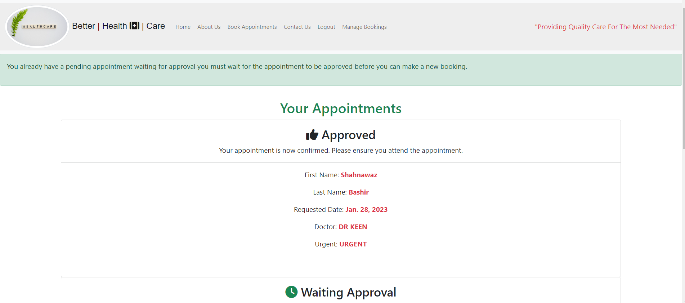

| Location            | Action               | Expected Result                                        | Pass/Fail |
| ------------------- | -------------------- | ------------------------------------------------------ | --------- |
| Delete Booking Page | Authentication error | Not allow another user to delete another users booking | Pass      |

+ Like the update booking page, the user could also access the delete booking page by accessing the urls booking numbers, I added a defensive code and this restricted the user from accessing any other users booking. The user if attempted is alerted a error message and redirected to the manage booking page.

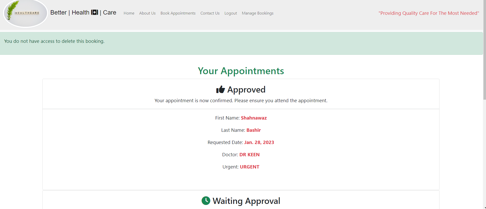

### Unfixed Bugs

Fortunately I did not have any bugs which I was not able to fix, I set myself targets and with a thorough testing plan I was able to eliminate all bugs and errors, which were identified during building my project.