# Project 4 - Better | Health | Care - A Online Booking System for Patients.

## Testing & Validation Checks 

### HTML Testing using NU-HTML-CHECKER

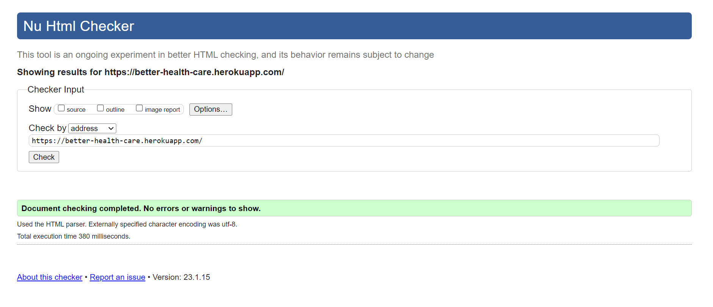

+ All my pages was checked via nu-html-checker, initally i got 38 errors, mostly due to unclosed div tags or stray tags, these were quickly rectified and the code was rechecked and recieved no errors or warnings. 

### CSS Validator using JIGSAW.W3

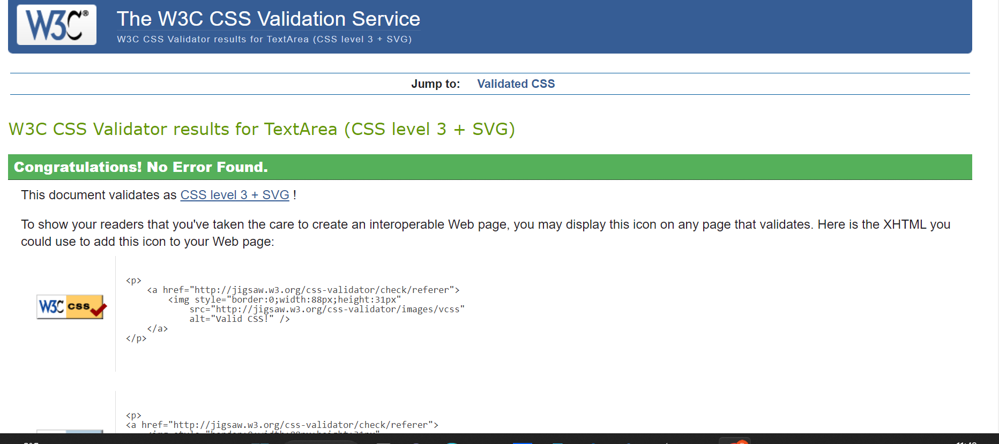

+ All my CSS was checked via Jigsaw W3.org, luckily I received no errors or warnings.  

### Javascript & JQuery using JSHINT 

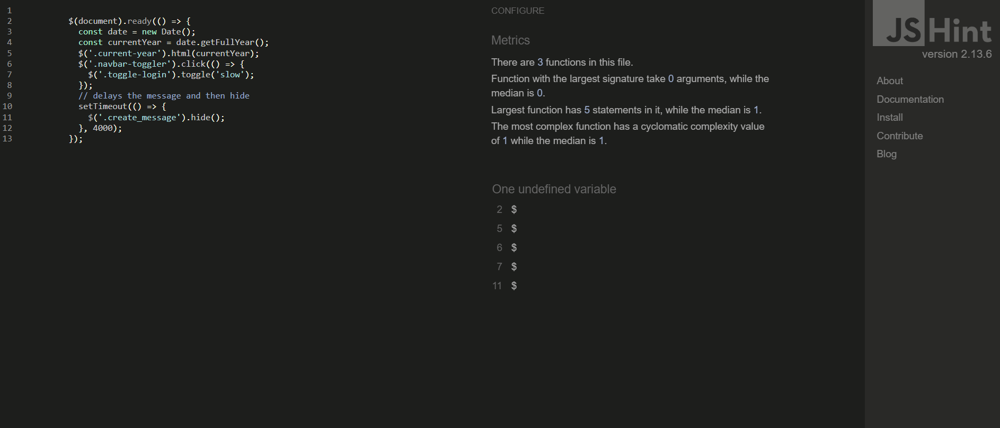

+ I did not have much Javascript, the code that I did have was checked on Jshint, by pasting the code in. I did initially have 8 warnings, as my code required semi-colons, this was rectified and the code was retested, and received no errors. I did however receive One undefined variable but checking with tutor support that this was because of the jquery and has no bearing affect to the validation

### Python - PEP8 Online checker (Code Institute Version)

#### Main App - Better Health Care - Urls File
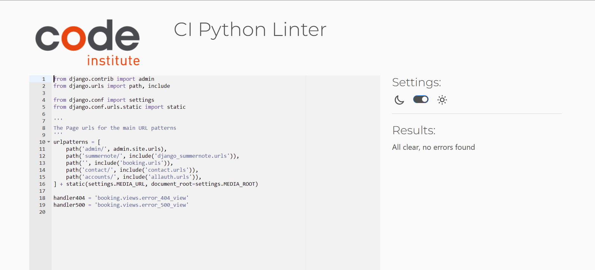

+ A few initial errors from the line being to long and having additional whitespaces. These were rectified and the code was retested, and received no errors.

#### Booking App - Admin File

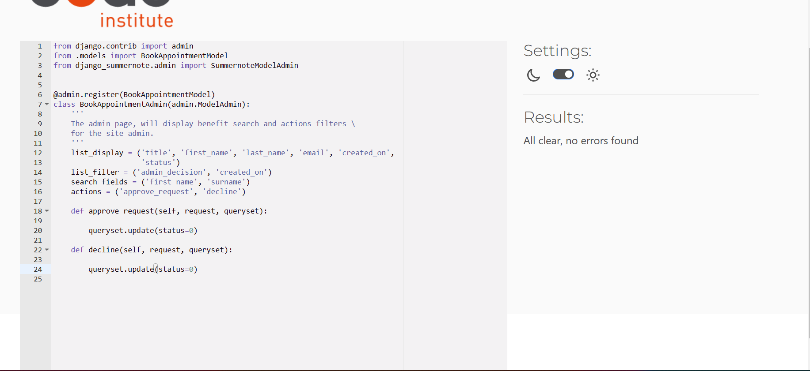

+ A few initial errors from the line being to long and having additional whitespaces. These were rectified and the code was retested, and received no errors.

#### Booking App - Form File
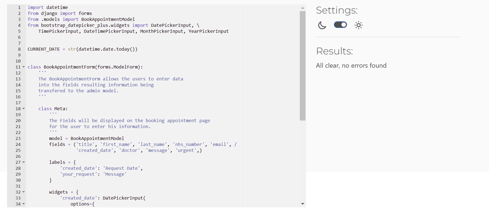

+ A few initial errors from the line being to long and having additional whitespaces. These were rectified and the code was retested, and received no errors.

#### Booking App - Urls File
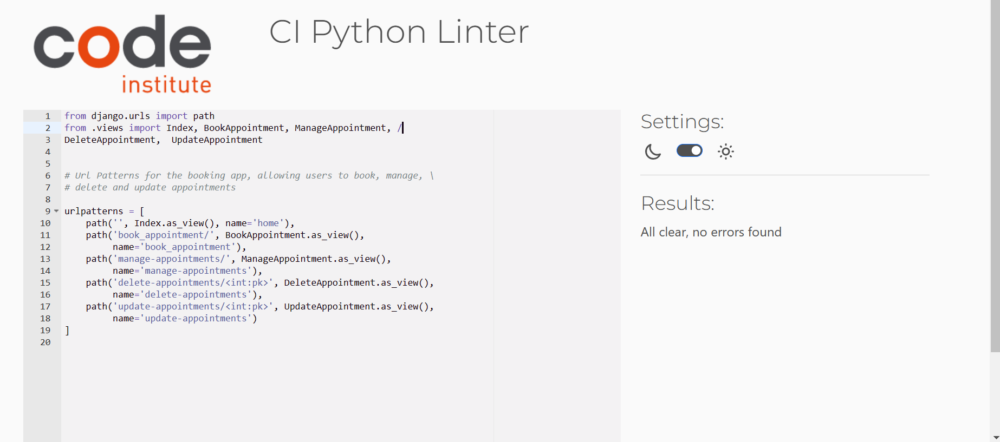

+ A few initial errors from the line being to long and having additional whitespaces. These were rectified and the code was retested, and received no errors.

#### Booking App - Views File

+ A few initial errors from the line being to long and having additional whitespaces. These were rectified and the code was retested, and received no errors.

#### Contact App - Urls File
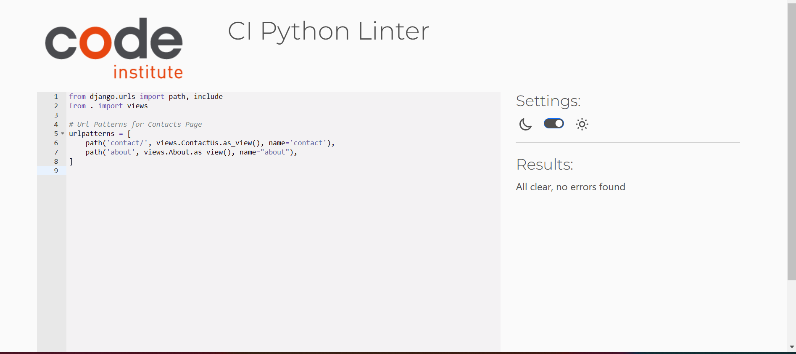

+ A few initial errors from the line being to long and having additional whitespaces. These were rectified and the code was retested, and received no errors.

#### Contact App - Form File
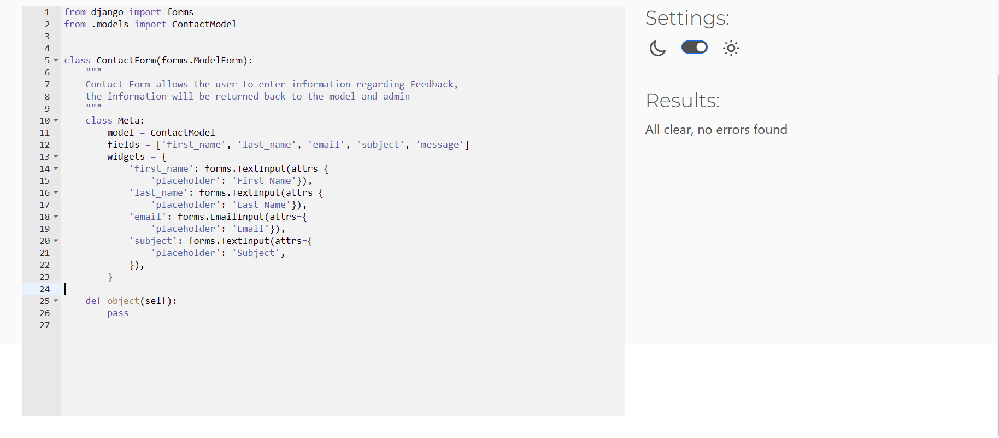

+ A few initial errors from the line being to long and having additional whitespaces. These were rectified and the code was retested, and received no errors.

#### Contact App - Models File
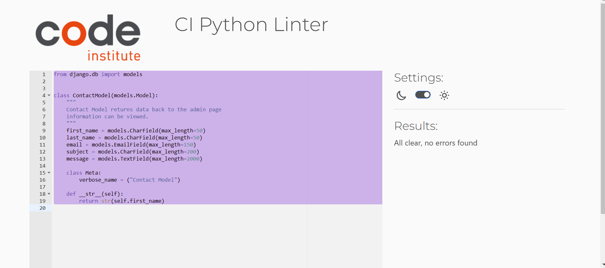

+ A few initial errors from the line being to long and having additional whitespaces. These were rectified and the code was retested, and received no errors.

#### Contact App - Views File
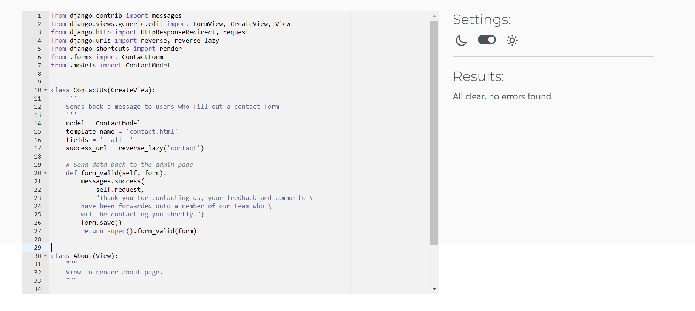

+ A few initial errors from the line being to long and having additional whitespaces. These were rectified and the code was retested, and received no errors.

#### Lighthouse Testing - Home Page
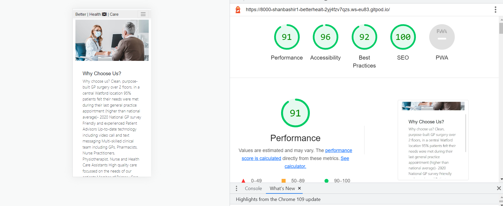

+ The test were carried out by using the Lighthouse checker, which evaluates and scores the site on the following categories: 
    + Performance
    + Accessbility
    + Best Practice
    + SEO

#### Lighthouse Testing - About Us Page
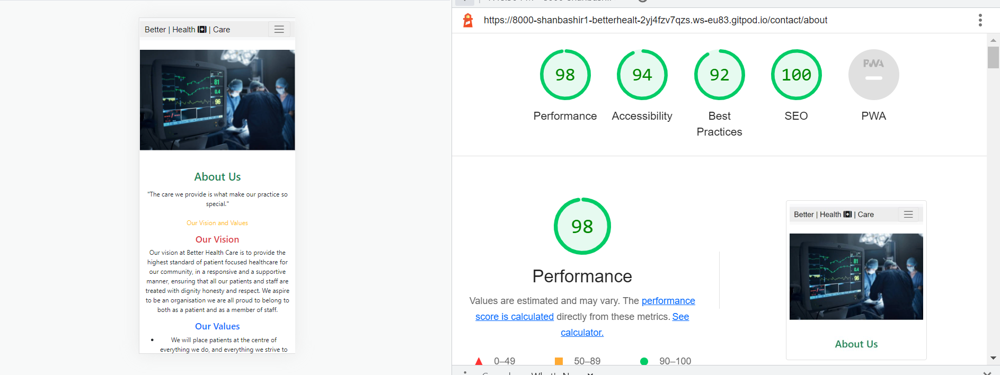

#### Lighthouse Testing - Booking Appointment Page
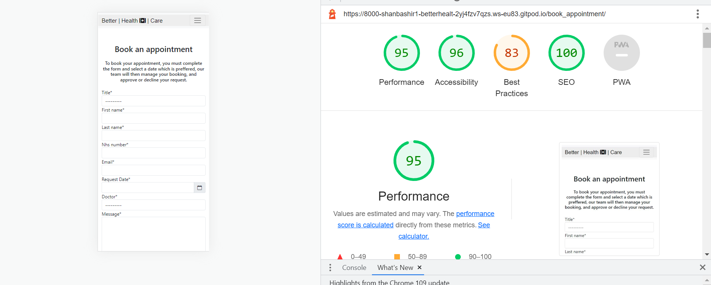

#### Lighthouse Testing - Manage Appointment Page
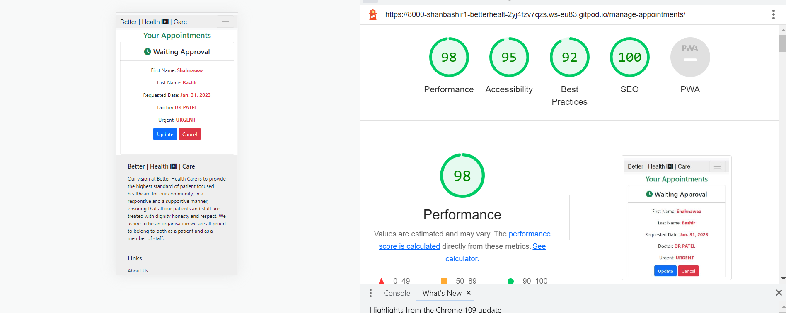

#### Lighthouse Testing - Contact Us Page
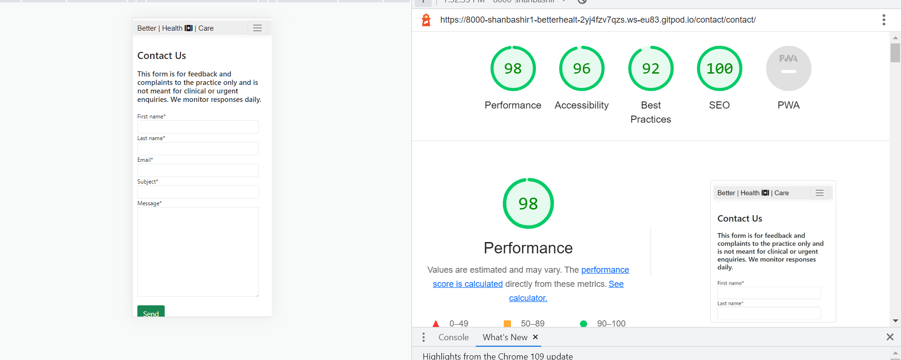